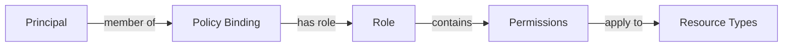

The Permissions Service (`wfa.measurement.access.v1alpha.Permissions`) provides APIs for managing permissions and checking what permissions a principal has on protected resources.

## Overview

Permissions are the foundation of the access control system:

- **Granular permissions** - Each permission represents a specific operation
- **Resource-scoped** - Permissions apply to specific resource types
- **Role composition** - Permissions are grouped into roles
- **Runtime checks** - Verify permissions before executing operations

## Permission Resource

A **Permission** represents a single operation that can be performed on a resource type.

<ParamField path="name" type="string">
  Resource name (identifier)
  
  **Format:** `permissions/{permission}`
  
  **Examples:**
  - `permissions/measurement.create`
  - `permissions/report.read`
  - `permissions/eventGroup.list`
</ParamField>

<ParamField path="resource_types" type="string[]" required>
  Set of resource types this permission can apply to
  
  **Examples:**
  - `["halo.wfanet.org/Measurement"]`
  - `["reporting.halo-cmm.org/Report", "reporting.halo-cmm.org/Metric"]`
  - `["*"]` - Applies to all resource types
</ParamField>

### Permission Naming Convention

Permission IDs follow the pattern `{resource}.{operation}`:

| Permission | Description |
|------------|-------------|
| `measurement.create` | Create measurements |
| `measurement.read` | Read measurement details |
| `measurement.list` | List measurements |
| `measurement.cancel` | Cancel measurements |
| `report.create` | Create reports |
| `report.read` | Read report results |
| `report.list` | List reports |
| `metric.create` | Create metrics |
| `metric.read` | Read metric results |
| `metric.invalidate` | Invalidate cached metrics |
| `eventGroup.list` | List event groups |
| `policy.manage` | Create and modify policies |

## Service Methods

### GetPermission

Retrieve a permission by resource name.

<ParamField path="name" type="string" required>
  Permission resource name
  
  **Format:** `permissions/{permission}`
</ParamField>

<ResponseField name="Permission" type="message">
  The requested permission resource
</ResponseField>

**Example:**
```python
from wfa.measurement.access.v1alpha import permissions_service_pb2

request = permissions_service_pb2.GetPermissionRequest(
    name="permissions/measurement.create"
)

permission = permissions_client.GetPermission(request)
print(f"Permission: {permission.name}")
print(f"Resource types: {permission.resource_types}")
```

**Error Codes:**
- `PERMISSION_NOT_FOUND` - Permission does not exist

### ListPermissions

List all available permissions in the system.

<ParamField path="page_size" type="int32">
  Maximum number of permissions to return
  
  **Default:** 50
  **Maximum:** 100
</ParamField>

<ParamField path="page_token" type="string">
  Token from previous ListPermissions call for pagination
</ParamField>

<ResponseField name="permissions" type="Permission[]">
  List of permission resources
</ResponseField>

<ResponseField name="next_page_token" type="string">
  Token for retrieving the next page (empty if no more pages)
</ResponseField>

**Example:**
```python
request = permissions_service_pb2.ListPermissionsRequest(
    page_size=100
)

response = permissions_client.ListPermissions(request)

for permission in response.permissions:
    print(f"Permission: {permission.name}")
    print(f"  Resource types: {permission.resource_types}")
    print()
```

### CheckPermissions

Check what permissions a principal has on a specific resource.

<ParamField path="protected_resource" type="string">
  Name of the resource to check permissions on
  
  **Format:** Resource-specific (e.g., `measurementConsumers/{id}/reports/{id}`)
  
  If not specified, checks permissions on the root of the API.
</ParamField>

<ParamField path="principal" type="string" required>
  Principal to check permissions for
  
  **Format:** `principals/{principal}`
</ParamField>

<ParamField path="permissions" type="string[]" required>
  Set of permissions to check
  
  **Example:** `["measurement.create", "measurement.read", "report.create"]`
</ParamField>

<ResponseField name="permissions" type="string[]">
  Subset of requested permissions that the principal has
  
  Empty array if principal has none of the requested permissions.
</ResponseField>

**Example:**
```python
request = permissions_service_pb2.CheckPermissionsRequest(
    protected_resource="measurementConsumers/123/reports/456",
    principal="principals/user-alice",
    permissions=[
        "report.read",
        "report.delete",
        "metric.create"
    ]
)

response = permissions_client.CheckPermissions(request)

print(f"Alice has permissions: {response.permissions}")
# Output: Alice has permissions: ['report.read', 'metric.create']

# Check if has specific permission
if "report.read" in response.permissions:
    print("Alice can read this report")
else:
    print("Access denied")
```

**Error Codes:**
- `PRINCIPAL_NOT_FOUND` - Principal does not exist
- `PERMISSION_NOT_FOUND` - One or more requested permissions don't exist

## Permission Check Patterns

### Pre-request Authorization

Check permissions before making API calls:

```python
def create_report_with_auth_check(principal_name, report_data):
    """
    Create a report only if principal has permission.
    """
    # Check permissions first
    check_request = permissions_service_pb2.CheckPermissionsRequest(
        protected_resource="measurementConsumers/123",
        principal=principal_name,
        permissions=["report.create"]
    )
    
    check_response = permissions_client.CheckPermissions(check_request)
    
    if "report.create" not in check_response.permissions:
        raise PermissionError("User lacks report.create permission")
    
    # Proceed with report creation
    return reports_client.CreateReport(report_data)
```

### Batch Permission Check

Check multiple permissions at once:

```python
def check_user_capabilities(principal_name, resource_name):
    """
    Check all relevant permissions for a resource.
    """
    request = permissions_service_pb2.CheckPermissionsRequest(
        protected_resource=resource_name,
        principal=principal_name,
        permissions=[
            "measurement.create",
            "measurement.read",
            "measurement.list",
            "measurement.cancel",
            "report.create",
            "report.read"
        ]
    )
    
    response = permissions_client.CheckPermissions(request)
    
    # Build capability map
    capabilities = {
        "can_create_measurement": "measurement.create" in response.permissions,
        "can_read_measurement": "measurement.read" in response.permissions,
        "can_list_measurements": "measurement.list" in response.permissions,
        "can_cancel_measurement": "measurement.cancel" in response.permissions,
        "can_create_report": "report.create" in response.permissions,
        "can_read_report": "report.read" in response.permissions,
    }
    
    return capabilities
```

### UI Authorization

Determine which UI elements to show:

```python
def get_ui_permissions(user_principal, measurement_consumer_id):
    """
    Get permissions for UI rendering.
    """
    request = permissions_service_pb2.CheckPermissionsRequest(
        protected_resource=f"measurementConsumers/{measurement_consumer_id}",
        principal=user_principal,
        permissions=[
            "measurement.create",
            "report.create",
            "report.read",
            "eventGroup.list",
            "metric.create",
            "policy.manage"
        ]
    )
    
    response = permissions_client.CheckPermissions(request)
    
    return {
        "show_create_measurement_button": "measurement.create" in response.permissions,
        "show_create_report_button": "report.create" in response.permissions,
        "show_reports_tab": "report.read" in response.permissions,
        "show_event_groups_tab": "eventGroup.list" in response.permissions,
        "show_metrics_tab": "metric.create" in response.permissions,
        "show_admin_panel": "policy.manage" in response.permissions,
    }
```

## Permission Hierarchy

Permissions can be organized hierarchically:

```
resource.*         # All operations on resource
├── resource.create
├── resource.read
├── resource.update
├── resource.delete
└── resource.list
```

<Note>
The system does not automatically grant wildcard permissions. Each permission must be explicitly assigned through roles and policies.
</Note>

## Integration with Roles and Policies

Permissions are granted to principals through the role-policy system:



**Example Policy:**
```python
# Create a role with permissions
role = roles_service_pb2.Role(
    name="roles/report-viewer",
    permissions=[
        "permissions/report.read",
        "permissions/report.list",
        "permissions/metric.read"
    ]
)

# Create a policy binding principal to role
policy = policies_service_pb2.Policy(
    protected_resource="measurementConsumers/123",
    bindings=[
        policies_service_pb2.Policy.Binding(
            role="roles/report-viewer",
            members=["principals/user-alice"]
        )
    ]
)

# Now CheckPermissions for alice will return the role's permissions
```

## Common Permission Sets

### Read-Only Access

```python
READ_ONLY_PERMISSIONS = [
    "measurement.read",
    "measurement.list",
    "report.read",
    "report.list",
    "metric.read",
    "metric.list",
    "eventGroup.list",
]
```

### Report Creator

```python
REPORT_CREATOR_PERMISSIONS = [
    "report.create",
    "report.read",
    "report.list",
    "metric.create",
    "metric.read",
    "eventGroup.list",
]
```

### Measurement Administrator

```python
MEASUREMENT_ADMIN_PERMISSIONS = [
    "measurement.create",
    "measurement.read",
    "measurement.list",
    "measurement.cancel",
    "report.create",
    "report.read",
    "report.list",
    "metric.create",
    "metric.read",
    "metric.list",
    "metric.invalidate",
    "eventGroup.list",
]
```

### System Administrator

```python
SYSTEM_ADMIN_PERMISSIONS = [
    "*"  # All permissions (must be defined as separate permission)
]
```

## Best Practices

<AccordionGroup>
  <Accordion title="Check permissions early">
    Verify permissions at the start of request handlers before expensive operations. Fail fast if unauthorized.
  </Accordion>
  
  <Accordion title="Use least privilege principle">
    Grant only the minimum permissions required for each role. Don't grant admin permissions by default.
  </Accordion>
  
  <Accordion title="Batch permission checks">
    When checking multiple permissions, use a single `CheckPermissions` call rather than multiple calls.
  </Accordion>
  
  <Accordion title="Cache permission check results">
    Cache CheckPermissions responses for short durations (e.g., 60 seconds) to reduce API calls, but balance with security needs.
  </Accordion>
  
  <Accordion title="Document permission requirements">
    Clearly document which permissions are required for each API operation in your API documentation.
  </Accordion>
  
  <Accordion title="Audit permission checks">
    Log failed permission checks for security monitoring and debugging authorization issues.
  </Accordion>
</AccordionGroup>

## Error Handling

<ResponseField name="PERMISSION_NOT_FOUND" type="error">
  One or more requested permissions don't exist
  
  **Resolution:** Verify permission names match defined permissions in the system
</ResponseField>

<ResponseField name="PRINCIPAL_NOT_FOUND" type="error">
  Principal does not exist
  
  **Resolution:** Verify principal resource name and ensure principal was created
</ResponseField>

<ResponseField name="INVALID_ARGUMENT" type="error">
  Invalid resource name format or empty permissions list
  
  **Resolution:** Verify request parameters follow correct format
</ResponseField>

## Related APIs

<CardGroup cols={3}>
  <Card title="Policies Service" icon="shield" href="/api/access/policies">
    Manage access policies
  </Card>
  
  <Card title="Principals Service" icon="user" href="/api/access/principals">
    Manage principals (users and services)
  </Card>
  
  <Card title="API Overview" icon="book" href="/api/overview">
    Access control architecture
  </Card>
</CardGroup>