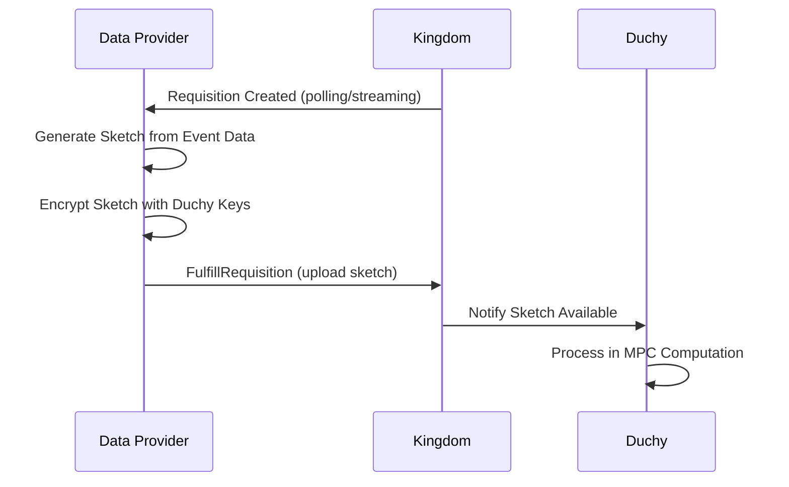

The Data Provider API enables publishers and data providers to fulfill measurement requisitions by submitting encrypted event data (sketches) for privacy-preserving computations.

## Overview

Data providers interact with the system to:

- Receive and fulfill requisitions from measurement consumers
- Upload encrypted sketches containing aggregated event data
- Manage event groups representing campaigns and content
- Track requisition lifecycle and fulfillment status

## Key Concepts

### Requisitions

A **Requisition** is a request for aggregated event data from a data provider, created when a measurement consumer initiates a measurement.

**Requisition Properties:**
- Specifies which event groups to include
- Includes encrypted measurement specification
- Contains duchy public keys for encryption
- Has a nonce for one-time fulfillment

### Sketches

A **Sketch** is a probabilistic data structure containing aggregated event information:

- **Liquid Legions Sketch** - For reach and frequency measurements
- **Encrypted Payload** - Data encrypted for duchy processing
- **No Raw Data** - Individual user data never exposed

### Event Groups

Data providers create **EventGroups** to organize events:

- Campaign impressions
- Video views
- App interactions
- Custom event types

## Requisition Fulfillment Flow



## Polling for Requisitions

### System API (v1alpha)

Data providers monitor for new requisitions using the system API:

```python
from wfa.measurement.system.v1alpha import requisitions_pb2

# The Kingdom makes requisitions available to data providers
# Data providers must poll or stream for new requisitions

def poll_for_requisitions(data_provider_id):
    # Query requisitions for this data provider
    # Implementation varies by deployment
    requisitions = get_unfulfilled_requisitions(data_provider_id)
    
    for requisition in requisitions:
        if requisition.state == requisitions_pb2.Requisition.UNFULFILLED:
            print(f"New requisition: {requisition.name}")
            fulfill_requisition(requisition)
```

### Requisition States

<ParamField path="state" type="enum">
  Current state of the requisition

  **Values:**
  - `UNFULFILLED` - Awaiting data provider fulfillment
  - `FULFILLED` - Sketch uploaded (terminal)
  - `REFUSED` - Data provider declined (terminal)
  - `WITHDRAWN` - Measurement consumer cancelled (terminal)
</ParamField>

## Generating Sketches

### Sketch Generation Process

1. **Query event data** - Retrieve events matching requisition spec
2. **Filter events** - Apply event filters from measurement spec
3. **Create sketch** - Build probabilistic data structure
4. **Encrypt sketch** - Encrypt with duchy public keys
5. **Upload sketch** - Submit to Kingdom

### Example: Liquid Legions Sketch

```python
import hashlib
from typing import List
from wfa.measurement.api.v2alpha import event_group_pb2

class SketchGenerator:
    def __init__(self, decay_rate: float, max_size: int):
        self.decay_rate = decay_rate
        self.max_size = max_size
    
    def generate_sketch(self, events: List[Event]) -> bytes:
        """
        Generate Liquid Legions sketch from event data.
        
        Args:
            events: List of user events with VIDs and metadata
            
        Returns:
            Serialized sketch bytes
        """
        sketch_registers = {}
        
        for event in events:
            # Hash VID to register index
            vid_hash = hashlib.sha256(event.vid.encode()).digest()
            register_index = int.from_bytes(vid_hash[:8], 'big') % self.max_size
            
            # Apply decay sampling
            if random.random() < self.decay_rate:
                if register_index not in sketch_registers:
                    sketch_registers[register_index] = {
                        'key': vid_hash,
                        'count': 0
                    }
                sketch_registers[register_index]['count'] += 1
        
        # Serialize sketch
        return self._serialize_sketch(sketch_registers)
    
    def _serialize_sketch(self, registers) -> bytes:
        # Protocol-specific serialization
        # Returns encrypted sketch bytes
        pass
```

## Encrypting Sketches

### Multi-Party Encryption

Sketches must be encrypted for duchy processing:

1. **Retrieve duchy public keys** - From requisition specification
2. **Layer encryption** - Each duchy adds encryption layer
3. **Hybrid encryption** - Combine symmetric and asymmetric encryption

```python
from cryptography.hazmat.primitives.asymmetric import ec
from cryptography.hazmat.primitives import hashes
from cryptography.hazmat.primitives.kdf.hkdf import HKDF

def encrypt_sketch_for_duchy(sketch_data: bytes, duchy_public_key: ec.EllipticCurvePublicKey) -> bytes:
    """
    Encrypt sketch data for a duchy using ECIES.
    
    Args:
        sketch_data: Raw sketch bytes
        duchy_public_key: Duchy's public key
        
    Returns:
        Encrypted sketch
    """
    # Generate ephemeral key pair
    ephemeral_private_key = ec.generate_private_key(ec.SECP256R1())
    ephemeral_public_key = ephemeral_private_key.public_key()
    
    # Perform ECDH
    shared_secret = ephemeral_private_key.exchange(
        ec.ECDH(), duchy_public_key
    )
    
    # Derive symmetric key
    derived_key = HKDF(
        algorithm=hashes.SHA256(),
        length=32,
        salt=None,
        info=b'sketch-encryption'
    ).derive(shared_secret)
    
    # Encrypt sketch data with AES-GCM
    encrypted_data = aes_gcm_encrypt(sketch_data, derived_key)
    
    # Package: ephemeral_public_key || encrypted_data
    return serialize_encrypted_sketch(ephemeral_public_key, encrypted_data)
```

## Fulfilling Requisitions

### FulfillRequisition RPC

<ParamField path="name" type="string" required>
  Resource name of the requisition to fulfill
  
  **Format:** `computations/{computation}/requisitions/{requisition}`
</ParamField>

<ParamField path="nonce" type="fixed64" required>
  One-time nonce value from the encrypted requisition spec
  
  Prevents replay attacks and double fulfillment.
</ParamField>

<ParamField path="fulfillment_context" type="FulfillmentContext">
  Additional context about the fulfillment
  
  **Fields:**
  - `build_label` - Software version that generated the sketch
  - `warnings` - Human-readable warnings about data quality (no sensitive data)
</ParamField>

<ParamField path="etag" type="string">
  Optional etag for optimistic concurrency control
  
  If specified and doesn't match current etag, returns ABORTED status.
</ParamField>

### Example: Fulfill Requisition

```python
from wfa.measurement.system.v1alpha import requisitions_service_pb2

def fulfill_requisition(requisition, sketch_data, nonce):
    # Upload sketch to storage
    sketch_uri = upload_to_blob_storage(sketch_data)
    
    # Mark requisition as fulfilled
    request = requisitions_service_pb2.FulfillRequisitionRequest(
        name=requisition.name,
        nonce=nonce,
        fulfillment_context=requisitions_service_pb2.Requisition.FulfillmentContext(
            build_label="edp-simulator-v1.2.3",
            warnings=[
                "Some events excluded due to data quality issues"
            ]
        )
    )
    
    response = requisitions_client.FulfillRequisition(request)
    print(f"Requisition fulfilled: {response.state}")
    return response
```

## Managing Event Groups

### Creating Event Groups

Data providers register event groups through the CMMS public API:

```python
from wfa.measurement.api.v2alpha import event_groups_pb2
from google.type import interval_pb2

request = event_groups_pb2.CreateEventGroupRequest(
    parent="dataProviders/456",
    event_group=event_groups_pb2.EventGroup(
        event_group_reference_id="campaign-2024-Q1",
        event_templates=[
            event_groups_pb2.EventGroup.EventTemplate(
                type="wfa.measurement.api.v2alpha.event_templates.BannerAd"
            )
        ],
        media_types=[event_groups_pb2.BANNER_AD],
        data_availability_interval=interval_pb2.Interval(
            start_time=timestamp_pb2.Timestamp(seconds=start_seconds),
            end_time=timestamp_pb2.Timestamp(seconds=end_seconds)
        ),
        event_group_metadata=event_groups_pb2.EventGroup.EventGroupMetadata(
            ad_metadata=event_groups_pb2.EventGroup.EventGroupMetadata.AdMetadata(
                campaign_metadata=event_groups_pb2.EventGroup.EventGroupMetadata.AdMetadata.CampaignMetadata(
                    brand_name="Acme Corp",
                    campaign_name="Spring 2024 Promo"
                )
            )
        )
    ),
    event_group_id="eg-123456"
)

event_group = event_groups_client.CreateEventGroup(request)
```

### Event Group Metadata

<ParamField path="event_group_reference_id" type="string">
  External identifier for this event group in data provider's system
</ParamField>

<ParamField path="event_templates" type="EventTemplate[]">
  Protocol buffer message types that events conform to
  
  **Example:** `wfa.measurement.api.v2alpha.event_templates.Video`
</ParamField>

<ParamField path="media_types" type="MediaType[]">
  Types of media in this event group
  
  **Values:** `VIDEO`, `BANNER_AD`, `NATIVE_AD`, `AUDIO`
</ParamField>

<ParamField path="data_availability_interval" type="Interval">
  Time range when events are available for measurement
  
  Measurement consumers use this to filter event groups.
</ParamField>

<ParamField path="event_group_metadata.ad_metadata" type="AdMetadata">
  Metadata for advertising campaigns
  
  **Fields:**
  - `campaign_metadata.brand_name` - Advertiser brand
  - `campaign_metadata.campaign_name` - Campaign identifier
</ParamField>

## Refusing Requisitions

Data providers can refuse requisitions they cannot fulfill:

```python
# To refuse a requisition, data providers typically use internal APIs
# The requisition state transitions to REFUSED
# This causes the parent measurement to enter FAILED state

def refuse_requisition(requisition_name, reason):
    # Implementation depends on deployment
    # Mark requisition as refused with reason
    mark_requisition_refused(requisition_name, reason)
```

<Warning>
Refusing a requisition will cause the entire measurement to fail. Only refuse requisitions if absolutely necessary (e.g., technical issues, policy violations).
</Warning>

## Data Quality Best Practices

<AccordionGroup>
  <Accordion title="Validate event data before sketch generation">
    Ensure VIDs are properly formatted, timestamps are valid, and required fields are present before generating sketches.
  </Accordion>
  
  <Accordion title="Apply consistent event filtering">
    Use the same filtering logic across all requisitions to ensure measurement consistency.
  </Accordion>
  
  <Accordion title="Monitor sketch generation metrics">
    Track sketch size, number of registers, and generation time to detect anomalies.
  </Accordion>
  
  <Accordion title="Use fulfillment context warnings">
    Document data quality issues in the `warnings` field to help measurement consumers interpret results.
  </Accordion>
  
  <Accordion title="Implement retry logic">
    If sketch upload fails, implement exponential backoff retry logic to handle transient network issues.
  </Accordion>
  
  <Accordion title="Secure nonce handling">
    Treat nonces as secrets and never log or expose them in plaintext. Verify nonce uniqueness before fulfillment.
  </Accordion>
</AccordionGroup>

## Error Handling

### Common Error Scenarios

<ResponseField name="INVALID_ARGUMENT" type="error">
  Invalid requisition name format or malformed nonce
  
  **Resolution:** Verify resource name follows pattern and nonce is 64-bit fixed integer
</ResponseField>

<ResponseField name="NOT_FOUND" type="error">
  Requisition does not exist or has been withdrawn
  
  **Resolution:** Refresh requisition list and skip withdrawn requisitions
</ResponseField>

<ResponseField name="FAILED_PRECONDITION" type="error">
  Requisition already fulfilled or in wrong state
  
  **Resolution:** Check requisition state before attempting fulfillment
</ResponseField>

<ResponseField name="ABORTED" type="error">
  ETag mismatch indicating concurrent modification
  
  **Resolution:** Retry with updated requisition and fresh etag
</ResponseField>

<ResponseField name="PERMISSION_DENIED" type="error">
  Data provider lacks permission to fulfill this requisition
  
  **Resolution:** Verify authentication credentials and requisition ownership
</ResponseField>

## Security Considerations

<AccordionGroup>
  <Accordion title="Encrypt sketches properly">
    Always encrypt sketches with duchy public keys using approved cryptographic libraries. Never upload unencrypted event data.
  </Accordion>
  
  <Accordion title="Validate duchy certificates">
    Verify duchy public key certificates are signed by trusted certificate authorities before encryption.
  </Accordion>
  
  <Accordion title="Protect nonce values">
    Nonces are cryptographic secrets that prevent replay attacks. Store and transmit them securely.
  </Accordion>
  
  <Accordion title="Use mTLS for authentication">
    Data provider services should authenticate using mutual TLS with X.509 certificates.
  </Accordion>
  
  <Accordion title="Audit fulfillment operations">
    Log all requisition fulfillments with timestamps and operator IDs for security auditing.
  </Accordion>
</AccordionGroup>

## Related APIs

<CardGroup cols={2}>
  <Card title="System: Requisition Fulfillment" icon="server" href="/api/system/requisition-fulfillment">
    Low-level requisition fulfillment system API
  </Card>
  
  <Card title="Measurement Consumer API" icon="chart-line" href="/api/measurement-consumer">
    How measurement consumers create measurements
  </Card>
</CardGroup>