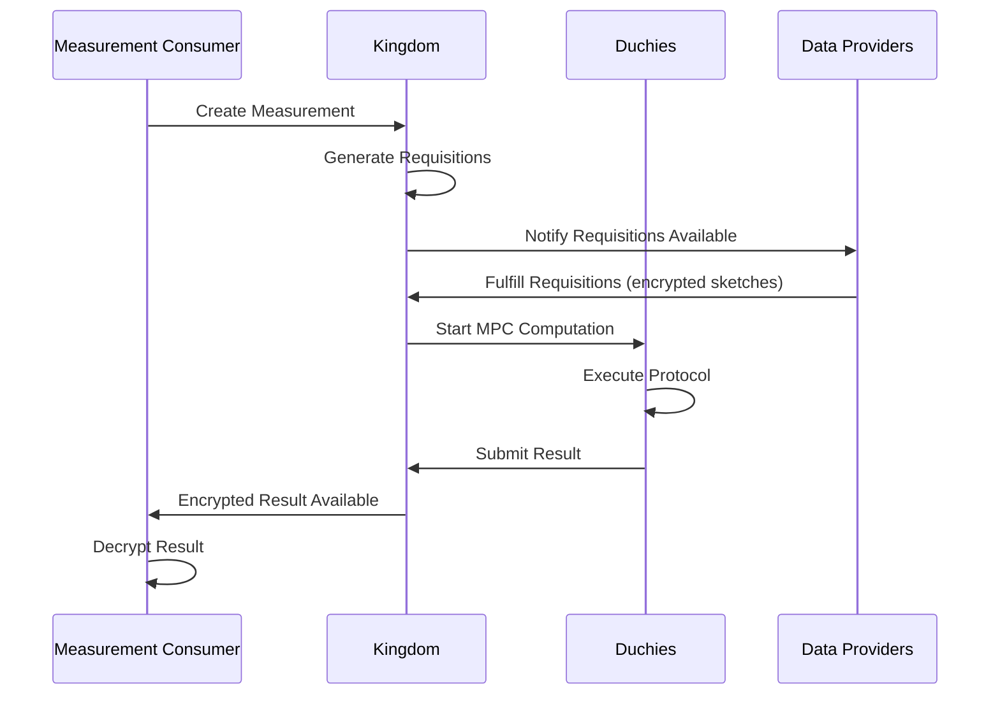

The Measurement Consumer API enables advertisers and measurement consumers to request cross-media measurements while preserving user privacy through secure multi-party computation (MPC).

## Overview

Measurement consumers use these APIs to:

- Define measurement specifications (reach, frequency, impressions)
- Create measurements across multiple data providers
- Retrieve encrypted measurement results
- Manage event groups and reporting sets

<Note>
While the system provides a Reporting API (v2alpha) for high-level report generation, the underlying measurement primitives are managed through the CMMS (Cross-Media Measurement System) public API.
</Note>

## Key Concepts

### Measurements

A **Measurement** represents a privacy-preserving computation across one or more data providers to calculate aggregate metrics.

**Measurement Types:**
- **REACH** - Count of unique users reached
- **REACH_AND_FREQUENCY** - Reach with frequency distribution histogram
- **IMPRESSION_COUNT** - Total impression count with differential privacy
- **WATCH_DURATION** - Total watch duration for video content
- **POPULATION_COUNT** - Count of unique members in a population

### Event Groups

An **EventGroup** is a collection of user events defined by a data provider:

- Campaign impression events
- Video viewing events  
- App interaction events
- Custom event types via protocol buffers

### Measurement Specifications

A **MeasurementSpec** defines:

- Metric type (reach, frequency, etc.)
- Event filters and groupings
- Privacy parameters (epsilon, delta)
- VID sampling intervals
- Differential privacy noise configuration

## Creating Measurements

### Measurement Request Flow



### Example: Create Reach Measurement

```python
from wfa.measurement.api.v2alpha import measurements_pb2

# Define measurement specification
measurement_spec = measurements_pb2.MeasurementSpec(
    reach=measurements_pb2.MeasurementSpec.Reach(
        privacy_params=measurements_pb2.DifferentialPrivacyParams(
            epsilon=0.01,
            delta=1e-12
        )
    ),
    vid_sampling_interval=measurements_pb2.MeasurementSpec.VidSamplingInterval(
        start=0.0,
        width=1.0
    )
)

# Create measurement
request = measurements_pb2.CreateMeasurementRequest(
    parent="measurementConsumers/123",
    measurement=measurements_pb2.Measurement(
        measurement_spec=measurement_spec,
        event_groups=[
            "dataProviders/456/eventGroups/789",
            "dataProviders/456/eventGroups/790"
        ]
    ),
    measurement_id="my-reach-measurement",
    request_id="550e8400-e29b-41d4-a716-446655440000"  # Idempotency token
)

response = measurements_client.CreateMeasurement(request)
```

## Measurement Lifecycle

### States

<ParamField path="state" type="enum">
  Current state of the measurement

  **Values:**
  - `PENDING_REQUISITION_PARAMS` - Waiting for duchy parameters
  - `PENDING_REQUISITION_FULFILLMENT` - Waiting for data providers to fulfill requisitions
  - `PENDING_PARTICIPANT_CONFIRMATION` - Waiting for duchy confirmation
  - `PENDING_COMPUTATION` - Computation in progress
  - `SUCCEEDED` - Completed successfully (terminal)
  - `FAILED` - Computation failed (terminal)
  - `CANCELLED` - Cancelled by consumer (terminal)
</ParamField>

### Polling for Results

```python
import time

while True:
    measurement = measurements_client.GetMeasurement(
        name="measurementConsumers/123/measurements/my-reach-measurement"
    )
    
    if measurement.state == measurements_pb2.Measurement.SUCCEEDED:
        # Decrypt and process result
        result = decrypt_measurement_result(
            measurement.encrypted_result,
            private_key
        )
        print(f"Reach: {result.reach.value}")
        break
    elif measurement.state == measurements_pb2.Measurement.FAILED:
        print(f"Measurement failed: {measurement.failure.message}")
        break
    
    time.sleep(30)  # Poll every 30 seconds
```

## Event Group APIs

### Listing Event Groups

Query available event groups from data providers:

```python
from wfa.measurement.reporting.v2alpha import event_groups_service_pb2

request = event_groups_service_pb2.ListEventGroupsRequest(
    parent="measurementConsumers/123",
    structured_filter=event_groups_service_pb2.ListEventGroupsRequest.Filter(
        cmms_data_provider_in=["dataProviders/456"],
        media_types_intersect=[event_groups_service_pb2.VIDEO],
        data_availability_start_time_on_or_after=timestamp_pb2.Timestamp(
            seconds=int(datetime(2024, 1, 1).timestamp())
        )
    ),
    page_size=100
)

response = event_groups_client.ListEventGroups(request)

for event_group in response.event_groups:
    print(f"Event Group: {event_group.name}")
    print(f"  Data Provider: {event_group.cmms_data_provider}")
    print(f"  Media Types: {event_group.media_types}")
```

### Event Group Filters

<ParamField path="structured_filter.cmms_data_provider_in" type="string[]">
  Filter to specific data provider resource names
</ParamField>

<ParamField path="structured_filter.media_types_intersect" type="MediaType[]">
  Event groups must include at least one of these media types
  
  **Values:** `VIDEO`, `BANNER_AD`, `NATIVE_AD`, `AUDIO`
</ParamField>

<ParamField path="structured_filter.data_availability_start_time_on_or_after" type="Timestamp">
  Filter by data availability window start time
</ParamField>

<ParamField path="structured_filter.metadata_search_query" type="string">
  Text search on event group metadata fields (campaign name, brand name, etc.)
</ParamField>

## Privacy Parameters

### Differential Privacy

All measurements use differential privacy to protect individual user privacy:

<ParamField path="epsilon" type="double">
  Privacy budget parameter (lower = more privacy, higher = more accuracy)
  
  **Typical range:** 0.001 to 1.0
</ParamField>

<ParamField path="delta" type="double">
  Failure probability parameter
  
  **Typical range:** 1e-15 to 1e-9
</ParamField>

### VID Sampling

Control which virtual IDs (VIDs) are included in measurements:

<ParamField path="vid_sampling_interval.start" type="float">
  Start of sampling interval in [0, 1)
  
  **Example:** 0.0 starts from beginning
</ParamField>

<ParamField path="vid_sampling_interval.width" type="float">
  Width of sampling interval (must be ≤ 1.0)
  
  **Example:** 0.1 samples 10% of VID space
</ParamField>

<Note>
When `--allow-sampling-interval-wrapping` is enabled, sampling intervals can wrap around. For example, start=0.8 and width=0.5 represents intervals [0.0, 0.3] and [0.8, 1.0].
</Note>

## Metric-Specific Parameters

### Reach and Frequency

<ParamField path="maximum_frequency" type="int32">
  Maximum frequency value in histogram (default varies by protocol)
  
  Frequencies above this value are aggregated into a single bin.
</ParamField>

### Impression Count

<ParamField path="maximum_frequency_per_user" type="int32">
  Maximum impressions per user (default: 60 for audiences > 1M)
  
  Higher values increase noise variance but reduce truncation bias.
</ParamField>

### Watch Duration

<ParamField path="maximum_watch_duration_per_user" type="Duration">
  Maximum watch duration per user (default: 4000 seconds for audiences > 1M)
  
  Caps contribution of individual users to protect privacy.
</ParamField>

## Result Decryption

Measurement results are encrypted with the measurement consumer's public key:

1. **Retrieve encrypted result** - `Measurement.encrypted_result` field
2. **Verify signature** - Using duchy's certificate
3. **Decrypt result** - Using measurement consumer's private key
4. **Parse Result message** - Protocol buffer deserialization

```python
from wfa.measurement.api.v2alpha import measurement_pb2
from cryptography.hazmat.primitives import serialization, hashes
from cryptography.hazmat.primitives.asymmetric import padding

def decrypt_measurement_result(encrypted_result, private_key_pem):
    # Load private key
    private_key = serialization.load_pem_private_key(
        private_key_pem.encode(),
        password=None
    )
    
    # Decrypt result
    decrypted_data = private_key.decrypt(
        encrypted_result,
        padding.OAEP(
            mgf=padding.MGF1(algorithm=hashes.SHA256()),
            algorithm=hashes.SHA256(),
            label=None
        )
    )
    
    # Parse result protobuf
    result = measurement_pb2.Result()
    result.ParseFromString(decrypted_data)
    return result
```

## Best Practices

<AccordionGroup>
  <Accordion title="Use idempotency tokens">
    Always provide a `request_id` (UUID) when creating measurements to prevent duplicate submissions if requests are retried.
  </Accordion>
  
  <Accordion title="Monitor measurement state">
    Implement exponential backoff when polling for measurement completion. Most measurements complete within minutes but can take longer during high load.
  </Accordion>
  
  <Accordion title="Choose appropriate privacy parameters">
    Consult with privacy experts to select epsilon and delta values that balance privacy protection with measurement accuracy for your use case.
  </Accordion>
  
  <Accordion title="Filter event groups efficiently">
    Use structured filters to query only relevant event groups before creating measurements, reducing unnecessary requisitions.
  </Accordion>
  
  <Accordion title="Reuse measurements when possible">
    If measuring the same event groups with the same parameters, consider caching results rather than creating duplicate measurements.
  </Accordion>
</AccordionGroup>

## Related APIs

<CardGroup cols={2}>
  <Card title="Reporting API" icon="chart-line" href="/api/reporting">
    High-level reporting with automated metric calculations
  </Card>
  
  <Card title="Data Provider API" icon="database" href="/api/data-provider">
    How data providers fulfill measurement requisitions
  </Card>
</CardGroup>