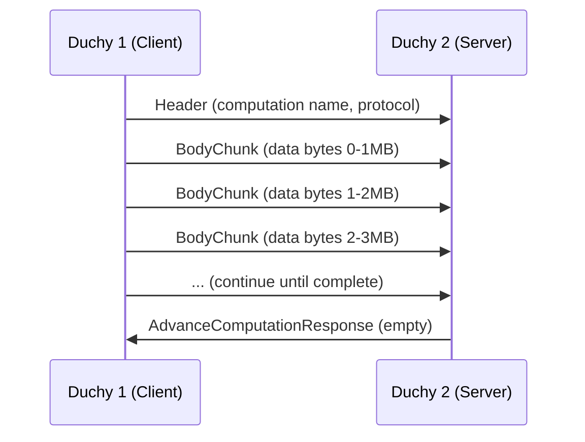
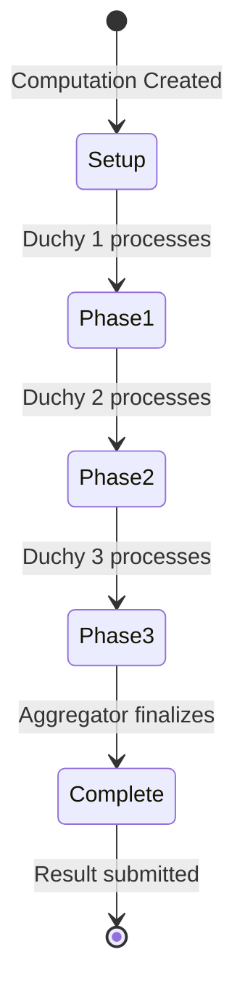

The Computation Control Service (`wfa.measurement.system.v1alpha.ComputationControl`) enables Duchies to coordinate multi-party computation (MPC) protocol execution for privacy-preserving measurements.

<Warning>
This is a **system-level API** used for internal communication between Kingdom and Duchy services. It is not intended for direct use by measurement consumers or data providers.
</Warning>

## Overview

The Computation Control Service provides:

- **Inter-duchy protocol coordination** - Duchies advance computations by exchanging encrypted data
- **Streaming data transfer** - Large encrypted sketches transferred via streaming RPC
- **Protocol-agnostic interface** - Supports multiple MPC protocols
- **Stage management** - Track computation progress through protocol stages

## Supported MPC Protocols

The service supports three MPC protocols:

### Liquid Legions V2

**Three-round protocol** for reach and frequency:

- **Setup Phase** - Initialize sketch parameters
- **Execution Phase One** - First duchy processing
- **Execution Phase Two** - Second duchy processing  
- **Execution Phase Three** - Final aggregation

**Use case:** Full reach-and-frequency measurements with histogram

### Reach-Only Liquid Legions V2

**One-round protocol** for reach only:

- **Setup Phase** - Initialize parameters
- **Execution Phase** - Single-round computation

**Use case:** Faster reach-only measurements

### Honest Majority Share Shuffle

**Shuffle-based protocol** for reach and frequency:

- **Shuffle Phase One** - First shuffle round
- **Shuffle Phase Two** - Second shuffle round
- **Aggregation Phase** - Final aggregation

**Use case:** Alternative MPC protocol with different security assumptions

## Service Definition

### AdvanceComputation

Streaming RPC to advance a computation by sending encrypted data to another duchy.

<ParamField path="header" type="AdvanceComputationRequest.Header">
  First message in the stream containing metadata
  
  **Required fields:**
  - `name` - Computation resource name
  - `protocol` - Protocol-specific configuration (one of `liquid_legions_v2`, `reach_only_liquid_legions_v2`, `honest_majority_share_shuffle`)
</ParamField>

<ParamField path="body_chunk" type="AdvanceComputationRequest.BodyChunk">
  Subsequent messages containing data chunks
  
  **Field:**
  - `partial_data` - Bytes chunk of encrypted computation data
</ParamField>

<ResponseField name="AdvanceComputationResponse" type="message">
  Empty response indicating successful processing
</ResponseField>

### GetComputationStage

Retrieve the current stage of a computation for a specific duchy.

<ParamField path="name" type="string" required>
  Resource name of the computation stage
  
  **Format:** `computations/{computation}/participants/{duchy}/computationStage`
</ParamField>

<ResponseField name="ComputationStage" type="message">
  Current stage information for the computation
  
  Contains protocol-specific stage details
</ResponseField>

## Protocol Configurations

### Liquid Legions V2 Protocol

<ParamField path="liquid_legions_v2.description" type="enum" required>
  Type of data being transferred
  
  **Values:**
  - `SETUP_PHASE_INPUT` - Initial setup data
  - `EXECUTION_PHASE_ONE_INPUT` - First execution phase data
  - `EXECUTION_PHASE_TWO_INPUT` - Second execution phase data
  - `EXECUTION_PHASE_THREE_INPUT` - Final execution phase data
</ParamField>

**Example:**
```protobuf
header {
  name: "computations/abc123"
  liquid_legions_v2 {
    description: EXECUTION_PHASE_ONE_INPUT
  }
}
```

### Reach-Only Liquid Legions V2 Protocol

<ParamField path="reach_only_liquid_legions_v2.description" type="enum" required>
  Type of data being transferred
  
  **Values:**
  - `SETUP_PHASE_INPUT` - Initial setup data
  - `EXECUTION_PHASE_INPUT` - Execution phase data
</ParamField>

### Honest Majority Share Shuffle Protocol

<ParamField path="honest_majority_share_shuffle.description" type="enum" required>
  Type of data being transferred
  
  **Values:**
  - `SHUFFLE_PHASE_INPUT_ONE` - First shuffle phase data
  - `SHUFFLE_PHASE_INPUT_TWO` - Second shuffle phase data
  - `AGGREGATION_PHASE_INPUT` - Aggregation phase data
</ParamField>

## Usage Examples

### Advancing a Liquid Legions V2 Computation

```python
import grpc
from wfa.measurement.system.v1alpha import computation_control_service_pb2
from wfa.measurement.system.v1alpha import computation_control_service_pb2_grpc

def advance_computation_streaming(stub, computation_name, encrypted_data):
    """
    Advance a computation by streaming encrypted data to another duchy.
    
    Args:
        stub: ComputationControl gRPC stub
        computation_name: Resource name of the computation
        encrypted_data: Encrypted sketch data bytes
    """
    def request_iterator():
        # First message: header
        yield computation_control_service_pb2.AdvanceComputationRequest(
            header=computation_control_service_pb2.AdvanceComputationRequest.Header(
                name=computation_name,
                liquid_legions_v2=computation_control_service_pb2.LiquidLegionsV2(
                    description=computation_control_service_pb2.LiquidLegionsV2.EXECUTION_PHASE_ONE_INPUT
                )
            )
        )
        
        # Subsequent messages: data chunks
        chunk_size = 1024 * 1024  # 1MB chunks
        for i in range(0, len(encrypted_data), chunk_size):
            chunk = encrypted_data[i:i + chunk_size]
            yield computation_control_service_pb2.AdvanceComputationRequest(
                body_chunk=computation_control_service_pb2.AdvanceComputationRequest.BodyChunk(
                    partial_data=chunk
                )
            )
    
    # Send streaming request
    response = stub.AdvanceComputation(request_iterator())
    return response

# Usage
with grpc.secure_channel('duchy.example.com:443', credentials) as channel:
    stub = computation_control_service_pb2_grpc.ComputationControlStub(channel)
    advance_computation_streaming(
        stub,
        "computations/abc123",
        encrypted_sketch_data
    )
```

### Getting Computation Stage

```python
def get_computation_stage(stub, computation_name, duchy_id):
    """
    Retrieve the current stage of a computation for a duchy.
    
    Args:
        stub: ComputationControl gRPC stub
        computation_name: Computation resource name
        duchy_id: Duchy identifier
    
    Returns:
        ComputationStage message
    """
    stage_name = f"{computation_name}/participants/{duchy_id}/computationStage"
    
    request = computation_control_service_pb2.GetComputationStageRequest(
        name=stage_name
    )
    
    stage = stub.GetComputationStage(request)
    return stage

# Usage
stage = get_computation_stage(stub, "computations/abc123", "duchy-1")
print(f"Current stage: {stage}")
```

## Streaming Protocol

The `AdvanceComputation` RPC uses client-side streaming:



**Streaming Benefits:**
- Handles large encrypted datasets (GB-scale)
- Memory-efficient processing
- Supports network interruption recovery
- Enables progress tracking

## Computation Lifecycle

Typical flow for a three-duchy Liquid Legions V2 computation:



**Stage Transitions:**

1. **Setup Phase**
   - Duchies receive computation parameters
   - Initialize local state
   - Prepare for execution

2. **Execution Phases**
   - Each duchy processes encrypted data in sequence
   - Uses `AdvanceComputation` to send results to next duchy
   - Updates local computation stage

3. **Finalization**
   - Aggregator duchy decrypts final result
   - Submits encrypted result to Kingdom
   - Computation transitions to `SUCCEEDED` state

## Security Considerations

<AccordionGroup>
  <Accordion title="Mutual TLS Required">
    All duchy-to-duchy communication MUST use mutual TLS authentication with valid X.509 certificates.
  </Accordion>
  
  <Accordion title="Encrypt All Data">
    Data transmitted via `AdvanceComputation` must be encrypted using the receiving duchy's public key. Never send plaintext sketches.
  </Accordion>
  
  <Accordion title="Verify Computation State">
    Before advancing a computation, verify it's in the correct state using `GetComputationStage` to prevent protocol violations.
  </Accordion>
  
  <Accordion title="Rate Limiting">
    Implement rate limiting on `AdvanceComputation` calls to prevent resource exhaustion from malicious or buggy clients.
  </Accordion>
  
  <Accordion title="Audit Logging">
    Log all computation control operations with duchy identifiers, computation IDs, and timestamps for security auditing.
  </Accordion>
</AccordionGroup>

## Error Handling

<ResponseField name="INVALID_ARGUMENT" type="error">
  Invalid computation name or protocol configuration
  
  **Resolution:** Verify resource name format and protocol parameters
</ResponseField>

<ResponseField name="NOT_FOUND" type="error">
  Computation or computation stage not found
  
  **Resolution:** Verify computation exists and duchy is a participant
</ResponseField>

<ResponseField name="FAILED_PRECONDITION" type="error">
  Computation not in correct state for advancement
  
  **Resolution:** Check computation state before advancing
</ResponseField>

<ResponseField name="ABORTED" type="error">
  Stream interrupted or protocol violation detected
  
  **Resolution:** Retry with exponential backoff
</ResponseField>

<ResponseField name="RESOURCE_EXHAUSTED" type="error">
  Too many concurrent computations or data too large
  
  **Resolution:** Implement backoff and reduce concurrent operations
</ResponseField>

## Related APIs

<CardGroup cols={2}>
  <Card title="Computations Service" icon="server" href="/api/system/requisition-fulfillment">
    Computation lifecycle management
  </Card>
  
  <Card title="Duchy Protocol" icon="network-wired" href="/api/system/duchy-protocol">
    Inter-duchy communication protocols
  </Card>
</CardGroup>