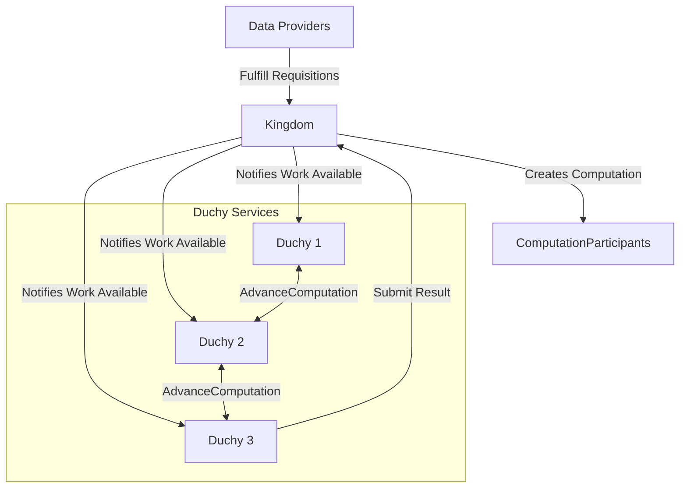
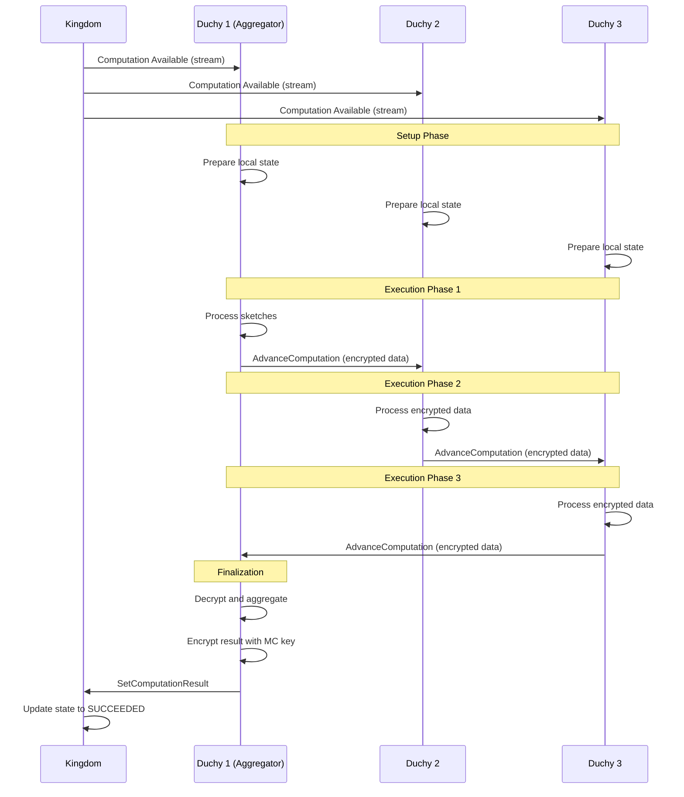
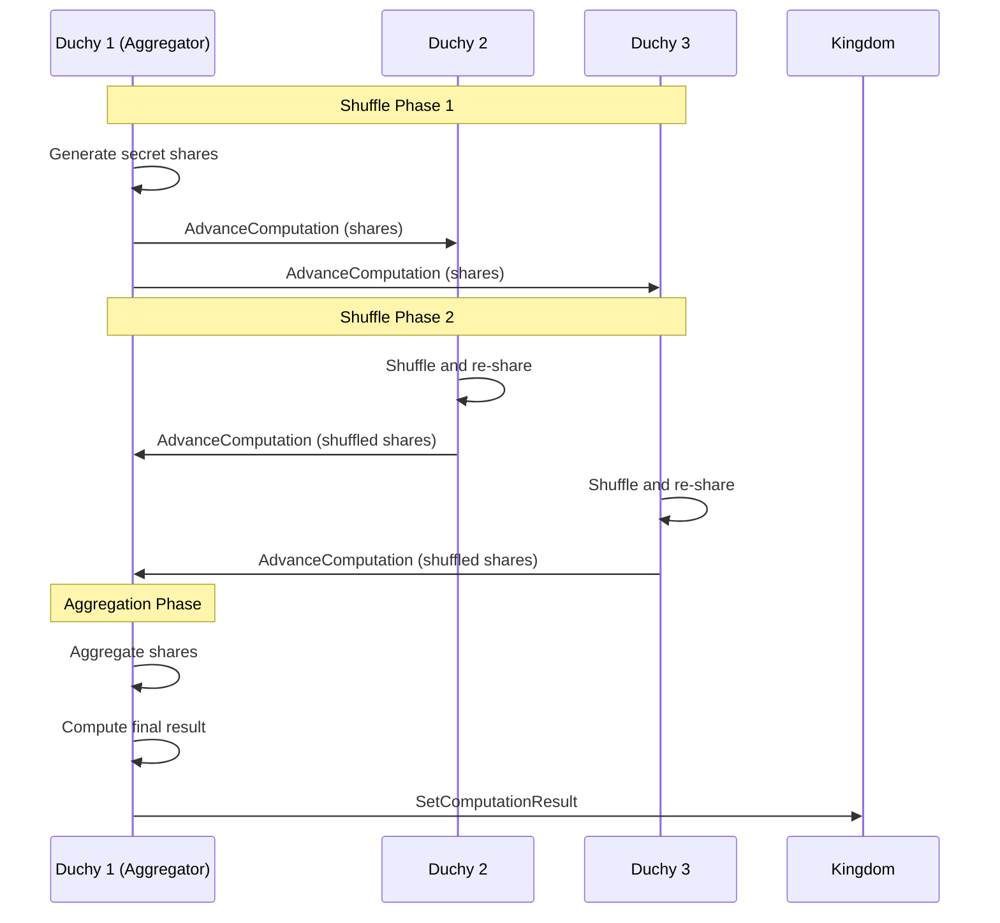

The Duchy Protocol APIs enable secure communication and coordination between duchies during multi-party computation (MPC) execution for privacy-preserving measurements.

<Warning>
These are **internal system APIs** used exclusively for duchy-to-duchy communication. They are not accessible to measurement consumers or data providers.
</Warning>

## Overview

Duchies collaborate to execute MPC protocols that compute aggregate metrics without revealing individual user data. The duchy protocol APIs provide:

- **Encrypted data exchange** - Duchies pass encrypted sketches through computation stages
- **Work claiming** - Duchies claim computation work from the shared work queue
- **Stage coordination** - Track progress through multi-stage protocols
- **Participant management** - Coordinate which duchies participate in each computation

## MPC Protocol Architecture



## Key Services

### Computations Service

Manages computation lifecycle from duchy perspective:

- `GetComputation` - Retrieve computation details
- `StreamActiveComputations` - Long-lived stream of active computations
- `SetComputationResult` - Submit final encrypted result

### Computation Control Service

Coordinates computation advancement between duchies:

- `AdvanceComputation` - Send encrypted data to next duchy in sequence
- `GetComputationStage` - Query current computation stage

See [Computation Control Service](/api/system/computation-control) for detailed documentation.

### Computation Participants Service

Manages duchy participation in computations:

- Register duchy as participant
- Confirm readiness for computation
- Update participant state

## Computation Streaming

Duchies use long-lived streams to monitor for new work:

### StreamActiveComputations

<ParamField path="continuation_token" type="string">
  Token indicating where to resume streaming
  
  Used for fault tolerance and resuming after disconnection.
</ParamField>

<ResponseField name="computation" type="Computation">
  An active computation resource
  
  Computations may appear multiple times if updated during stream lifetime.
</ResponseField>

<ResponseField name="continuation_token" type="string">
  Token for subsequent requests to resume stream
  
  Should be persisted by duchies for crash recovery.
</ResponseField>

**Example:**
```python
import grpc
from wfa.measurement.system.v1alpha import computations_service_pb2
from wfa.measurement.system.v1alpha import computations_service_pb2_grpc

def stream_active_computations(stub, continuation_token=None):
    """
    Stream active computations for this duchy.
    
    This is a long-lived stream that yields computations as they
    become available or are updated.
    """
    request = computations_service_pb2.StreamActiveComputationsRequest(
        continuation_token=continuation_token or ""
    )
    
    try:
        for response in stub.StreamActiveComputations(request):
            computation = response.computation
            continuation_token = response.continuation_token
            
            # Persist token for crash recovery
            save_continuation_token(continuation_token)
            
            # Process computation
            print(f"Received computation: {computation.name}")
            print(f"State: {computation.state}")
            
            # Claim and process work
            if should_process_computation(computation):
                process_computation_work(computation)
                
    except grpc.RpcError as e:
        print(f"Stream error: {e.code()} - {e.details()}")
        # Reconnect with last known continuation token
        stream_active_computations(stub, continuation_token)
```

## Computation States

<ParamField path="state" type="enum">
  Current state of the computation
  
  **Values:**
  - `PENDING_REQUISITION_PARAMS` - Awaiting duchy parameters
  - `PENDING_REQUISITION_FULFILLMENT` - Awaiting data provider sketches
  - `PENDING_PARTICIPANT_CONFIRMATION` - Duchies confirming participation
  - `PENDING_COMPUTATION` - MPC protocol execution in progress
  - `SUCCEEDED` - Computation completed successfully (terminal)
  - `FAILED` - Computation failed (terminal)
  - `CANCELLED` - Cancelled by measurement consumer (terminal)
</ParamField>

## Protocol Execution Flow

### Liquid Legions V2 (3 Duchies)



### Honest Majority Share Shuffle (3 Duchies)



## Setting Computation Result

The aggregator duchy submits the final result:

### SetComputationResult

<ParamField path="name" type="string" required>
  Resource name of the computation
  
  **Format:** `computations/{computation}`
</ParamField>

<ParamField path="aggregator_certificate" type="string" required>
  Certificate resource name of the aggregator duchy
  
  **Format:** `duchies/{duchy}/certificates/{certificate}`
  
  Used to verify the signed result.
</ParamField>

<ParamField path="result_public_key" type="bytes" required>
  Serialized encryption public key from measurement consumer
  
  The result is encrypted with this key.
</ParamField>

<ParamField path="encrypted_result" type="bytes" required>
  Encrypted and signed Result message
  
  Contains:
  - Encrypted metric value (reach, frequency histogram, etc.)
  - Signature from aggregator duchy
  - Metadata about computation
</ParamField>

<ParamField path="public_api_version" type="string" required>
  Version of the public API for message serialization
  
  **Example:** `"v2alpha"`
</ParamField>

**Example:**
```python
def submit_computation_result(
    stub,
    computation_name: str,
    aggregator_cert_name: str,
    encrypted_result: bytes,
    result_public_key: bytes
):
    """
    Submit final encrypted result for a computation.
    
    Args:
        stub: Computations service gRPC stub
        computation_name: Computation resource name
        aggregator_cert_name: Aggregator duchy certificate name
        encrypted_result: Encrypted and signed result bytes
        result_public_key: Measurement consumer's public key
    """
    request = computations_service_pb2.SetComputationResultRequest(
        name=computation_name,
        aggregator_certificate=aggregator_cert_name,
        result_public_key=result_public_key,
        encrypted_result=encrypted_result,
        public_api_version="v2alpha"
    )
    
    computation = stub.SetComputationResult(request)
    print(f"Result submitted for: {computation.name}")
    print(f"New state: {computation.state}")
    return computation
```

## MPC Protocol Configuration

Each computation includes protocol-specific configuration:

### Liquid Legions V2 Config

<ParamField path="mpc_protocol_config.liquid_legions_v2" type="LiquidLegionsV2">
  Configuration for Liquid Legions V2 protocol
  
  **Fields:**
  - `sketch_params.decay_rate` - Sketch decay rate (e.g., 12.0)
  - `sketch_params.max_size` - Maximum sketch size (e.g., 100000)
  - `mpc_noise.blinded_histogram_noise` - DP params for histogram noise
  - `mpc_noise.publisher_noise` - DP params for publisher noise
  - `elliptic_curve_id` - OpenSSL curve ID (e.g., 415 for prime256v1)
  - `noise_mechanism` - GEOMETRIC, DISCRETE_GAUSSIAN, or CONTINUOUS_GAUSSIAN
</ParamField>

### Honest Majority Share Shuffle Config

<ParamField path="mpc_protocol_config.honest_majority_share_shuffle" type="HonestMajorityShareShuffle">
  Configuration for HMSS protocol
  
  **Fields:**
  - `reach_and_frequency_ring_modulus` - Modulus for R&F (e.g., 2^32)
  - `reach_ring_modulus` - Modulus for reach-only (e.g., 2^16)
  - `noise_mechanism` - Noise generation method
</ParamField>

## Computation Participants

Each computation has multiple duchy participants:

<ParamField path="computation_participants" type="ComputationParticipant[]">
  Denormalized list of participating duchies
  
  Each participant includes:
  - `name` - Participant resource name
  - `duchy_id` - Duchy identifier
  - `state` - Participant-specific state
  - `requisitions` - Requisitions assigned to this duchy
</ParamField>

## Requisition Assignment

Requisitions are assigned to duchy participants:

```python
def get_assigned_requisitions(computation, duchy_id):
    """
    Get requisitions assigned to a specific duchy.
    
    Args:
        computation: Computation message
        duchy_id: Identifier of the duchy
    
    Returns:
        List of Requisition messages
    """
    assigned_requisitions = []
    
    for requisition in computation.requisitions:
        # Extract duchy from fulfilling_computation_participant
        if duchy_id in requisition.fulfilling_computation_participant:
            assigned_requisitions.append(requisition)
    
    return assigned_requisitions
```

## Work Claiming Pattern

Duchies implement a work queue pattern:

```python
class DuchyWorker:
    def __init__(self, duchy_id, stub):
        self.duchy_id = duchy_id
        self.stub = stub
        self.active_computations = {}
    
    def run(self):
        """Main worker loop."""
        continuation_token = self._load_continuation_token()
        
        for response in self.stub.StreamActiveComputations(
            computations_service_pb2.StreamActiveComputationsRequest(
                continuation_token=continuation_token
            )
        ):
            computation = response.computation
            continuation_token = response.continuation_token
            
            # Persist token
            self._save_continuation_token(continuation_token)
            
            # Check if this duchy should process
            if self._is_participant(computation):
                # Claim work if not already processing
                if computation.name not in self.active_computations:
                    self._claim_computation(computation)
                
                # Process computation stage
                self._process_computation_stage(computation)
    
    def _is_participant(self, computation):
        """Check if this duchy is a participant."""
        for participant in computation.computation_participants:
            if participant.duchy_id == self.duchy_id:
                return True
        return False
    
    def _claim_computation(self, computation):
        """Claim computation for processing."""
        self.active_computations[computation.name] = computation
        print(f"Claimed computation: {computation.name}")
    
    def _process_computation_stage(self, computation):
        """Process current stage of computation."""
        # Implementation depends on protocol and current stage
        pass
```

## Security Considerations

<AccordionGroup>
  <Accordion title="Mutual TLS Required">
    All duchy-to-duchy communication must use mutual TLS with certificate verification. Never accept connections from untrusted duchies.
  </Accordion>
  
  <Accordion title="Verify Computation State">
    Before processing a computation, verify it's in the expected state. Protocol violations could compromise security.
  </Accordion>
  
  <Accordion title="Validate Encrypted Data">
    Verify that encrypted data received from other duchies uses correct encryption schemes and key versions.
  </Accordion>
  
  <Accordion title="Isolate Computation Workers">
    Run computation workers in isolated processes or containers to prevent cross-computation information leakage.
  </Accordion>
  
  <Accordion title="Audit All Operations">
    Log all computation operations with duchy identifiers, computation IDs, stages, and timestamps for security auditing.
  </Accordion>
  
  <Accordion title="Rate Limit Connections">
    Implement rate limiting on streaming RPCs and data transfer to prevent resource exhaustion attacks.
  </Accordion>
</AccordionGroup>

## Error Handling

<ResponseField name="INVALID_ARGUMENT" type="error">
  Invalid computation name or parameters
  
  **Resolution:** Verify resource names and protocol configuration
</ResponseField>

<ResponseField name="NOT_FOUND" type="error">
  Computation not found or not visible to this duchy
  
  **Resolution:** Verify duchy is a participant in the computation
</ResponseField>

<ResponseField name="FAILED_PRECONDITION" type="error">
  Computation not in correct state
  
  **Common causes:**
  - Trying to advance computation that's not ready
  - Submitting result before all stages complete
  
  **Resolution:** Check computation state and wait for state transition
</ResponseField>

<ResponseField name="ABORTED" type="error">
  Operation aborted due to concurrent modification
  
  **Resolution:** Retry operation with updated computation state
</ResponseField>

<ResponseField name="DEADLINE_EXCEEDED" type="error">
  Computation took too long to complete
  
  **Resolution:** Increase computation timeout or optimize processing
</ResponseField>

## Performance Optimization

<AccordionGroup>
  <Accordion title="Stream multiplexing">
    Use a single `StreamActiveComputations` connection per duchy rather than multiple streams to reduce overhead.
  </Accordion>
  
  <Accordion title="Parallel computation processing">
    Process multiple independent computations in parallel using worker pools to maximize throughput.
  </Accordion>
  
  <Accordion title="Chunk size optimization">
    When streaming data via `AdvanceComputation`, use 1-4MB chunks to balance memory usage and network efficiency.
  </Accordion>
  
  <Accordion title="Continuation token persistence">
    Persist continuation tokens frequently (after each computation update) to minimize reprocessing after crashes.
  </Accordion>
  
  <Accordion title="Computation result caching">
    Cache intermediate computation results to avoid recomputation if a stage needs to be retried.
  </Accordion>
</AccordionGroup>

## Related APIs

<CardGroup cols={2}>
  <Card title="Computation Control" icon="network-wired" href="/api/system/computation-control">
    Detailed computation control service documentation
  </Card>
  
  <Card title="Requisition Fulfillment" icon="database" href="/api/system/requisition-fulfillment">
    How data providers fulfill requisitions
  </Card>
</CardGroup>