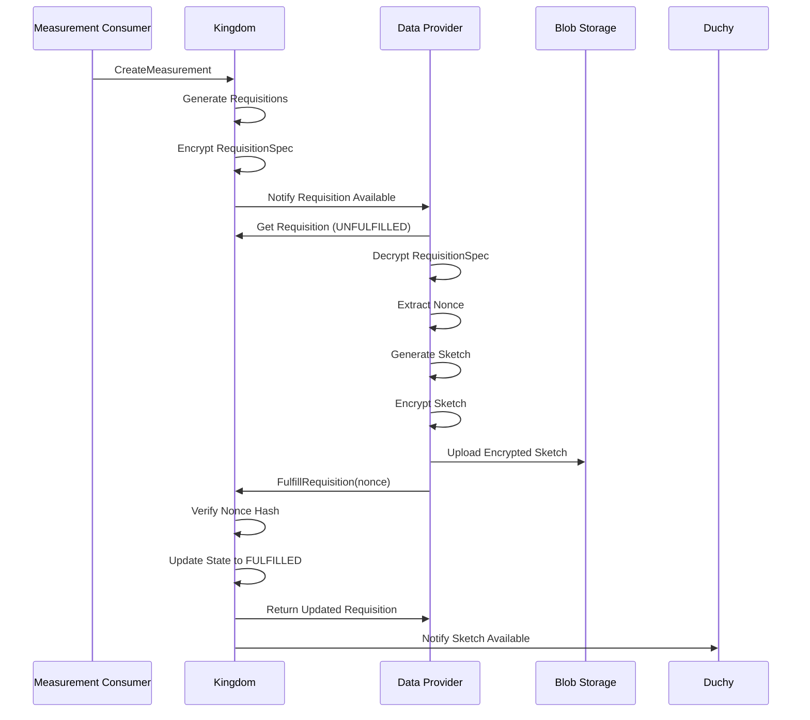
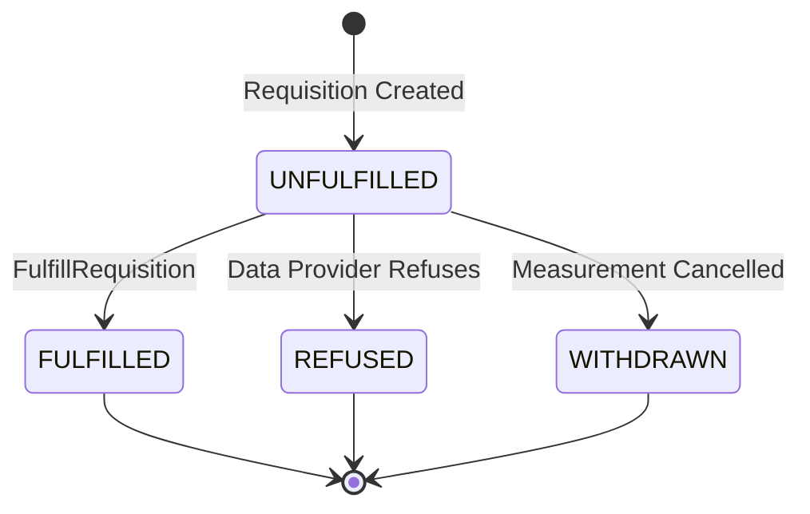

The Requisition Fulfillment Service (`wfa.measurement.system.v1alpha.Requisitions`) manages the lifecycle of requisitions from creation through fulfillment by data providers.

<Warning>
This is a **system-level API** used for internal communication between Kingdom and data provider services. Data providers typically use higher-level APIs or SDK methods that wrap this service.
</Warning>

## Overview

The Requisitions service provides:

- **Requisition state management** - Track requisition from creation to fulfillment
- **Sketch upload coordination** - Handle encrypted sketch submission
- **Nonce verification** - Prevent replay attacks and double fulfillment
- **Fulfillment context** - Capture metadata about sketch generation

## Requisition Resource

A **Requisition** represents a request for aggregated event data from a specific data provider.

<ParamField path="name" type="string">
  Resource name
  
  **Format:** `computations/{computation}/requisitions/{requisition}`
</ParamField>

<ParamField path="requisition_spec_hash" type="bytes">
  SHA-256 hash of encrypted requisition specification
  
  Immutable. Used to verify requisition integrity.
</ParamField>

<ParamField path="nonce_hash" type="bytes">
  SHA-256 hash of the nonce value
  
  Immutable. Used to verify nonce without exposing it.
</ParamField>

<ParamField path="state" type="enum">
  Current state of the requisition (output only)
  
  **Values:**
  - `UNFULFILLED` - Awaiting data provider fulfillment
  - `FULFILLED` - Sketch successfully uploaded (terminal)
  - `REFUSED` - Data provider declined to fulfill (terminal)
  - `WITHDRAWN` - Measurement consumer cancelled (terminal)
</ParamField>

<ParamField path="fulfilling_computation_participant" type="string">
  Duchy assigned to fulfill this requisition (output only)
  
  **Format:** `computations/{computation}/participants/{duchy}`
</ParamField>

<ParamField path="nonce" type="fixed64">
  Decrypted nonce value (output only)
  
  Only available after fulfillment. Used to verify sketch authenticity.
</ParamField>

<ParamField path="fulfillment_context" type="FulfillmentContext">
  Additional context about fulfillment (output only)
</ParamField>

## Service Methods

### FulfillRequisition

Transition a requisition from `UNFULFILLED` to `FULFILLED` state.

<ParamField path="name" type="string" required>
  Resource name of the requisition
  
  **Format:** `computations/{computation}/requisitions/{requisition}`
</ParamField>

<ParamField path="nonce" type="fixed64" required>
  Decrypted nonce from the requisition specification
  
  This value proves the data provider successfully decrypted the requisition spec.
</ParamField>

<ParamField path="fulfillment_context" type="FulfillmentContext">
  Additional context about the fulfillment
  
  **Fields:**
  - `build_label` - Version of software that generated the sketch
  - `warnings` - Array of human-readable warning messages (no sensitive data)
</ParamField>

<ParamField path="etag" type="string">
  Optional etag for optimistic concurrency control
  
  If specified and doesn't match current etag, returns `ABORTED` status.
</ParamField>

<ResponseField name="Requisition" type="message">
  Updated requisition resource with state set to `FULFILLED`
</ResponseField>

## Requisition Fulfillment Flow



## Usage Example

### Fulfilling a Requisition

```python
import grpc
from wfa.measurement.system.v1alpha import requisitions_service_pb2
from wfa.measurement.system.v1alpha import requisitions_service_pb2_grpc

def fulfill_requisition(
    stub,
    requisition_name: str,
    nonce: int,
    build_label: str,
    warnings: list[str] = None
):
    """
    Mark a requisition as fulfilled after uploading encrypted sketch.
    
    Args:
        stub: Requisitions service gRPC stub
        requisition_name: Full resource name of requisition
        nonce: Decrypted nonce from requisition spec
        build_label: Version identifier of sketch generator
        warnings: Optional list of warning messages
    
    Returns:
        Updated Requisition message with FULFILLED state
    """
    # Build fulfillment context
    fulfillment_context = requisitions_service_pb2.Requisition.FulfillmentContext(
        build_label=build_label
    )
    if warnings:
        fulfillment_context.warnings.extend(warnings)
    
    # Create request
    request = requisitions_service_pb2.FulfillRequisitionRequest(
        name=requisition_name,
        nonce=nonce,
        fulfillment_context=fulfillment_context
    )
    
    # Call service
    try:
        requisition = stub.FulfillRequisition(request)
        print(f"Requisition fulfilled: {requisition.name}")
        print(f"State: {requisition.state}")
        return requisition
    except grpc.RpcError as e:
        print(f"Error fulfilling requisition: {e.code()} - {e.details()}")
        raise

# Usage
with grpc.secure_channel('kingdom.example.com:443', credentials) as channel:
    stub = requisitions_service_pb2_grpc.RequisitionsStub(channel)
    
    requisition = fulfill_requisition(
        stub,
        requisition_name="computations/abc123/requisitions/req456",
        nonce=0x1234567890ABCDEF,  # Decrypted from requisition spec
        build_label="edp-simulator-v2.1.0",
        warnings=[
            "10 events excluded due to invalid timestamps",
            "Data coverage: 99.5%"
        ]
    )
```

### Complete Fulfillment Workflow

```python
import hashlib
from cryptography.hazmat.primitives import serialization
from cryptography.hazmat.primitives.asymmetric import padding
from cryptography.hazmat.primitives import hashes

class RequisitionFulfiller:
    def __init__(self, private_key_pem, blob_storage_client):
        self.private_key = serialization.load_pem_private_key(
            private_key_pem.encode(),
            password=None
        )
        self.storage = blob_storage_client
    
    def process_requisition(self, requisition, encrypted_spec):
        """
        Complete workflow: decrypt spec, generate sketch, fulfill requisition.
        """
        # 1. Decrypt requisition specification
        spec = self._decrypt_requisition_spec(encrypted_spec)
        nonce = spec.nonce
        
        # 2. Verify nonce hash
        computed_hash = hashlib.sha256(nonce.to_bytes(8, 'big')).digest()
        if computed_hash != requisition.nonce_hash:
            raise ValueError("Nonce hash mismatch")
        
        # 3. Generate sketch from event data
        events = self._query_events(spec.event_groups, spec.filters)
        sketch = self._generate_sketch(events, spec.sketch_params)
        
        # 4. Encrypt sketch with duchy keys
        encrypted_sketch = self._encrypt_sketch(sketch, spec.duchy_public_keys)
        
        # 5. Upload sketch to blob storage
        sketch_uri = self.storage.upload(
            data=encrypted_sketch,
            path=f"requisitions/{requisition.name}/sketch"
        )
        
        # 6. Fulfill requisition
        return self._fulfill_requisition(
            requisition_name=requisition.name,
            nonce=nonce,
            build_label="my-edp-v1.0.0"
        )
    
    def _decrypt_requisition_spec(self, encrypted_spec):
        """Decrypt requisition spec using data provider's private key."""
        decrypted = self.private_key.decrypt(
            encrypted_spec,
            padding.OAEP(
                mgf=padding.MGF1(algorithm=hashes.SHA256()),
                algorithm=hashes.SHA256(),
                label=None
            )
        )
        # Parse protobuf
        from wfa.measurement.api.v2alpha import requisition_spec_pb2
        spec = requisition_spec_pb2.RequisitionSpec()
        spec.ParseFromString(decrypted)
        return spec
    
    def _generate_sketch(self, events, sketch_params):
        """Generate Liquid Legions sketch from events."""
        # Implementation specific to sketch protocol
        pass
    
    def _encrypt_sketch(self, sketch, duchy_keys):
        """Layer encrypt sketch for duchy processing."""
        # Implementation specific to encryption protocol
        pass
```

## Nonce Verification

The nonce mechanism prevents replay attacks:

1. **Kingdom generates nonce** - Random 64-bit value
2. **Kingdom encrypts spec** - Nonce included in encrypted requisition spec
3. **Kingdom stores hash** - `requisition.nonce_hash = SHA256(nonce)`
4. **Data provider decrypts** - Extracts nonce from encrypted spec
5. **Data provider fulfills** - Sends nonce in `FulfillRequisition` call
6. **Kingdom verifies** - Computes SHA256(nonce) and compares with stored hash

<Note>
The nonce is only transmitted once during fulfillment. After fulfillment, it's stored in `requisition.nonce` for audit purposes.
</Note>

## Fulfillment Context

The `FulfillmentContext` message provides additional metadata:

<ParamField path="build_label" type="string">
  Version identifier of the software that generated the sketch
  
  **Example:** `"edp-simulator-v2.1.0"`, `"publisher-edp-v1.5.3"`
  
  Used for debugging and version tracking.
</ParamField>

<ParamField path="warnings" type="string[]">
  Human-readable warning messages about the fulfillment
  
  **Examples:**
  - `"5% of events excluded due to invalid VIDs"`
  - `"Data coverage: 98.3%"`
  - `"Some events outside requested time range"`
  
  <Warning>
  Must not include sensitive or personally identifiable information.
  </Warning>
</ParamField>

## State Transitions



**Terminal States:**
- `FULFILLED` - Success, sketch available for computation
- `REFUSED` - Data provider cannot/will not fulfill
- `WITHDRAWN` - Measurement consumer cancelled measurement

## Error Handling

<ResponseField name="INVALID_ARGUMENT" type="error">
  Invalid requisition name format or nonce value
  
  **Common causes:**
  - Malformed resource name
  - Nonce is 0 or negative
  - Missing required fields
</ResponseField>

<ResponseField name="NOT_FOUND" type="error">
  Requisition does not exist
  
  **Resolution:** Verify requisition name is correct and requisition hasn't been withdrawn
</ResponseField>

<ResponseField name="FAILED_PRECONDITION" type="error">
  Requisition not in UNFULFILLED state
  
  **Common causes:**
  - Already fulfilled (nonce verified on first call)
  - Already refused by data provider
  - Withdrawn by measurement consumer
  
  **Resolution:** Check requisition state before attempting fulfillment
</ResponseField>

<ResponseField name="ABORTED" type="error">
  Nonce hash verification failed or etag mismatch
  
  **Common causes:**
  - Incorrect nonce value (doesn't match hash)
  - Concurrent modification (etag mismatch)
  
  **Resolution:**
  - Verify nonce was decrypted correctly
  - Retry with fresh requisition and updated etag
</ResponseField>

<ResponseField name="PERMISSION_DENIED" type="error">
  Data provider lacks permission to fulfill this requisition
  
  **Resolution:** Verify authentication credentials and that requisition is assigned to this data provider
</ResponseField>

## Security Best Practices

<AccordionGroup>
  <Accordion title="Protect nonce values">
    Nonces are cryptographic secrets. Never log nonce values in plaintext or expose them in error messages.
  </Accordion>
  
  <Accordion title="Verify nonce hash before fulfillment">
    Before calling `FulfillRequisition`, verify that `SHA256(nonce)` matches `requisition.nonce_hash` to catch decryption errors early.
  </Accordion>
  
  <Accordion title="Use secure channels">
    Always use TLS (preferably mTLS) when communicating with the Kingdom to protect nonces in transit.
  </Accordion>
  
  <Accordion title="Upload sketches before fulfilling">
    Ensure encrypted sketches are successfully uploaded to blob storage before calling `FulfillRequisition`. Once fulfilled, requisitions cannot be re-fulfilled.
  </Accordion>
  
  <Accordion title="Validate sketch encryption">
    Verify that sketches are encrypted with the correct duchy public keys before upload to prevent data leakage.
  </Accordion>
  
  <Accordion title="Audit all fulfillments">
    Log all requisition fulfillments with timestamps, nonce hashes (not nonces), and operator IDs for security auditing.
  </Accordion>
</AccordionGroup>

## Related APIs

<CardGroup cols={2}>
  <Card title="Data Provider API" icon="database" href="/api/data-provider">
    Higher-level data provider APIs
  </Card>
  
  <Card title="Computation Control" icon="server" href="/api/system/computation-control">
    Duchy computation coordination
  </Card>
</CardGroup>