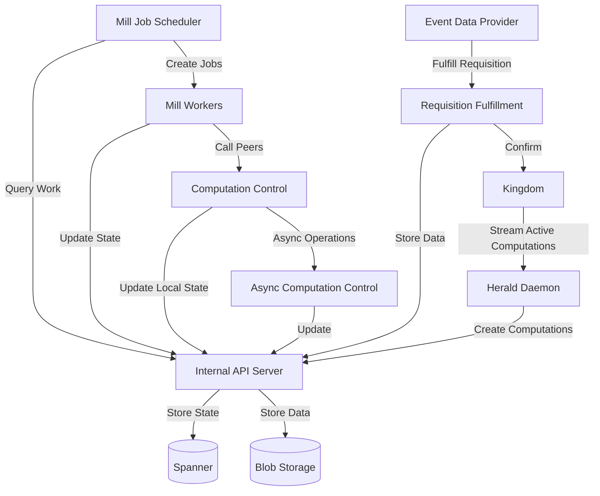

A Duchy deployment consists of multiple gRPC services that handle different aspects of secure computation. These services work together to execute multi-party computation protocols, coordinate with peer duchies, and communicate with the Kingdom.

## Service Overview

<CardGroup cols={2}>
  <Card title="Internal API Server" icon="database">
    Manages computation state in local Spanner
  </Card>
  <Card title="Computation Control Server" icon="network-wired">
    Coordinates multi-party computation with peers
  </Card>
  <Card title="Requisition Fulfillment Server" icon="download">
    Receives encrypted data from EDPs
  </Card>
  <Card title="Async Computation Control" icon="arrows-spin">
    Asynchronous computation coordination
  </Card>
</CardGroup>

## Internal API Server

**Image**: `duchy/internal-api`  
**Service Name**: `{duchy-name}-internal-api-server`  
**Port**: 8443 (gRPC), 8080 (health)

### Purpose

The Internal API Server is the **database access layer** for the duchy. It provides internal gRPC services for managing computation state, storing requisition metadata, and tracking computation progress.

### Responsibilities

- Provide CRUD operations for computations in Spanner
- Manage computation tokens and work locking
- Store requisition metadata and fulfillment status
- Track computation statistics and metrics
- Manage continuation tokens for resumable operations
- Execute database schema migrations via init containers

### Key Services

Implemented in `src/main/kotlin/org/wfanet/measurement/duchy/service/internal/`:

<Accordion title="ComputationsService">
  **File**: `computations/ComputationsService.kt`
  
  Core service for computation lifecycle management:
  - Create new computations
  - Update computation state and stage
  - Claim work via token mechanism
  - Query computations by state
  - Mark computations as completed or failed
  - Delete old computations (via cleaner)
</Accordion>

<Accordion title="ComputationStatsService">
  **File**: `computationstats/ComputationStatsService.kt`
  
  Tracks metrics and performance data:
  - Record stage execution times
  - Track retry attempts
  - Monitor computation progress
  - Provide debugging and monitoring data
</Accordion>

<Accordion title="ContinuationTokensService">
  Manages resumable operations:
  - Store tokens for long-running operations
  - Enable idempotent retry of failed operations
  - Support streaming operations with pagination
</Accordion>

### Configuration Flags

```bash
--duchy-name={duchy-id}
--tls-cert-file=/var/run/secrets/files/{duchy}_tls.pem
--tls-key-file=/var/run/secrets/files/{duchy}_tls.key
--cert-collection-file=/var/run/secrets/files/all_root_certs.pem
--kingdom-system-api-target={kingdom-system-api-endpoint}
--kingdom-system-api-cert-host=localhost
--channel-shutdown-timeout=3s
```

Plus Spanner configuration and blob storage flags.

### Storage Backend

The Internal API Server manages two storage systems:

**Spanner Database:**
- Computations table with state machine
- Requisitions table with metadata
- Computation stats for monitoring
- Token management for work claiming

**Blob Storage (GCS/S3):**
- Encrypted sketch data
- Intermediate computation results
- Protocol message payloads

### Network Policy

Only accessible from:
- Herald daemon
- Mill job scheduler
- Mill workers (LLv2, HMSS)
- Computation control servers
- Requisition fulfillment server
- Computations cleaner CronJob

## Computation Control Server

**Image**: `duchy/computation-control`  
**Service Name**: `{duchy-name}-computation-control-server`  
**Port**: 8443 (gRPC), 8080 (health)  
**Type**: External Service

### Purpose

The Computation Control Server enables **peer-to-peer coordination** between duchies during multi-party computation. It exposes endpoints that peer duchies call to advance computations through protocol stages.

### Responsibilities

- Accept computation data from peer duchies
- Validate incoming protocol messages
- Update local computation state based on peer input
- Enforce protocol stage ordering
- Handle retry and error scenarios
- Verify peer duchy identity and authorization

### API Design

Implemented in `src/main/kotlin/org/wfanet/measurement/duchy/service/system/v1alpha/`:

<Accordion title="ComputationControlService">
  **File**: `ComputationControlService.kt`
  
  Main service for inter-duchy coordination:
  - `AdvanceComputation`: Push computation to next stage
  - Accept encrypted protocol payloads from peers
  - Validate computation participant signatures
  - Coordinate with AsyncComputationControlService
  
  The service validates request headers to ensure:
  - Sender duchy is authorized participant
  - Computation exists and is in expected state
  - Protocol stage transition is valid
</Accordion>

<Accordion title="AdvanceComputationRequestHeaders">
  **File**: `AdvanceComputationRequestHeaders.kt`
  
  Metadata validation for peer requests:
  - Duchy identity verification
  - Protocol version compatibility
  - Request signature validation
</Accordion>

### Protocol Coordination

The Computation Control Server is called by mill workers in peer duchies:

```
Duchy A (Mill Worker) ──────> AdvanceComputation RPC ──────> Duchy B (Computation Control)
                                                              │
                                                              ▼
                                                    Updates local state
                                                    in Internal API
```

Example flow:
1. Duchy A completes shuffle phase
2. Duchy A calls Duchy B's Computation Control endpoint with shuffled data
3. Duchy B validates the request
4. Duchy B stores encrypted data in blob storage
5. Duchy B updates computation state to enable next stage

### Configuration Flags

```bash
--duchy-name={duchy-id}
--duchy-info-config=/var/run/secrets/files/duchy_cert_config.textproto
--tls-cert-file=/var/run/secrets/files/{duchy}_tls.pem
--tls-key-file=/var/run/secrets/files/{duchy}_tls.key
--cert-collection-file=/var/run/secrets/files/all_root_certs.pem
--computations-service-target={internal-api-server}:8443
--computations-service-cert-host=localhost
--async-computation-control-service-target={async-computation-control-server}:8443
--async-computation-control-service-cert-host=localhost
```

Plus blob storage configuration.

### Security

- **Mutual TLS**: All peer connections use mTLS
- **Certificate Validation**: Duchy identity verified via certificates
- **Request Signing**: Protocol messages include cryptographic signatures
- **Replay Protection**: Computation tokens prevent replay attacks

## Async Computation Control Server

**Image**: `duchy/async-computation-control`  
**Service Name**: `{duchy-name}-async-computation-control-server`  
**Port**: 8443 (gRPC), 8080 (health)

### Purpose

The Async Computation Control Server handles **asynchronous computation control** operations. It works in conjunction with the synchronous Computation Control Server to manage long-running protocol operations.

### Responsibilities

Implemented in `src/main/kotlin/org/wfanet/measurement/duchy/service/internal/computationcontrol/`:

- Asynchronous advancement of computation stages
- Non-blocking protocol coordination
- Background processing of protocol messages
- Decoupling of synchronous peer requests from local processing

<Accordion title="AsyncComputationControlService">
  **File**: `AsyncComputationControlService.kt`
  
  Provides asynchronous computation control:
  - Queues protocol operations for background processing
  - Enables non-blocking peer coordination
  - Manages computation state transitions asynchronously
</Accordion>

<Accordion title="ProtocolStages">
  **File**: `ProtocolStages.kt`
  
  Defines protocol stage state machines:
  - Valid stage transitions for each protocol
  - Stage-specific validation logic
  - Protocol completion detection
</Accordion>

### Configuration

```bash
--duchy-name={duchy-id}
--duchy-info-config=/var/run/secrets/files/duchy_cert_config.textproto
--tls-cert-file=/var/run/secrets/files/{duchy}_tls.pem
--tls-key-file=/var/run/secrets/files/{duchy}_tls.key
--cert-collection-file=/var/run/secrets/files/all_root_certs.pem
--computations-service-target={internal-api-server}:8443
--computations-service-cert-host=localhost
```

## Requisition Fulfillment Server

**Image**: `duchy/requisition-fulfillment`  
**Service Name**: `{duchy-name}-requisition-fulfillment-server`  
**Port**: 8443 (gRPC), 8080 (health)  
**Type**: External Service

### Purpose

The Requisition Fulfillment Server accepts **encrypted event data from Event Data Providers (EDPs)**. It provides the API endpoint that EDPs call to upload their encrypted sketches for measurements.

### Responsibilities

- Accept requisition fulfillment requests from EDPs
- Validate EDP authorization for requisitions
- Receive and store encrypted sketch data
- Verify data encryption and signatures
- Update requisition fulfillment status
- Notify Kingdom of successful fulfillment

### API Implementation

Implemented in `src/main/kotlin/org/wfanet/measurement/duchy/service/api/v2alpha/`:

<Accordion title="RequisitionFulfillmentService">
  **File**: `RequisitionFulfillmentService.kt`
  
  Main service for data ingestion:
  - `FulfillRequisition`: Upload encrypted sketch data
  - Validate EDP certificate and authorization
  - Verify requisition exists and is pending
  - Store encrypted data in blob storage
  - Update internal requisition metadata
  - Confirm fulfillment with Kingdom
  
  The service ensures:
  - Only authorized EDPs can fulfill requisitions
  - Data is properly encrypted with duchy's public key
  - Requisition can only be fulfilled once
  - Kingdom is notified upon successful upload
</Accordion>

### Data Flow

```
EDP ──────> FulfillRequisition RPC ──────> Requisition Fulfillment Server
                                                │
                                                ▼
                                    1. Validate EDP identity
                                    2. Check requisition status
                                    3. Store encrypted data
                                    4. Update Internal API
                                    5. Notify Kingdom
```

### Configuration Flags

```bash
--duchy-name={duchy-id}
--tls-cert-file=/var/run/secrets/files/{duchy}_tls.pem
--tls-key-file=/var/run/secrets/files/{duchy}_tls.key
--cert-collection-file=/var/run/secrets/files/all_root_certs.pem
--authority-key-identifier-to-principal-map-file=/etc/[app]/config-files/authority_key_identifier_to_principal_map.textproto
--computations-service-target={internal-api-server}:8443
--computations-service-cert-host=localhost
--kingdom-system-api-target={kingdom-system-api-endpoint}
--kingdom-system-api-cert-host=localhost
```

Plus blob storage configuration.

### Authentication

- **EDP Certificates**: EDPs authenticate using X.509 certificates
- **AKID Mapping**: Authority Key Identifier maps to EDP principal
- **Requisition Authorization**: Only the assigned EDP can fulfill a requisition

## Service Interaction Diagram



## Common Configuration Patterns

### Duchy Identity

All services require duchy identity configuration:
```bash
--duchy-name=worker1  # or worker2, aggregator, etc.
```

### TLS Configuration

Mutual TLS for all services:
```bash
--tls-cert-file=/var/run/secrets/files/{duchy}_tls.pem
--tls-key-file=/var/run/secrets/files/{duchy}_tls.key
--cert-collection-file=/var/run/secrets/files/all_root_certs.pem
```

### Internal API Client

Most services connect to the Internal API Server:
```bash
--computations-service-target={duchy}-internal-api-server:8443
--computations-service-cert-host=localhost
```

### Blob Storage

Services that handle computation data need blob storage:
```bash
# For Google Cloud
--google-cloud-storage-bucket=duchy-computation-storage
--google-cloud-storage-project=my-project

# For AWS
--aws-s3-bucket=duchy-computation-storage
--aws-region=us-west-2
```

## Deployment Architecture

All duchy services are defined in `src/main/k8s/duchy.cue`:

### Service Naming

Services are prefixed with duchy name:
- `worker1-internal-api-server`
- `worker1-computation-control-server`
- etc.

This allows multiple duchies to coexist in the same namespace (for testing).

### Dependencies

Services have explicit dependencies:
- Computation Control depends on: Internal API, Async Computation Control
- Requisition Fulfillment depends on: Internal API
- Mill Job Scheduler depends on: Internal API, Computation Control

### Health Checks

All services expose:
- gRPC health check service
- HTTP health endpoint on port 8080
- Kubernetes readiness and liveness probes

## Monitoring and Observability

<CardGroup cols={2}>
  <Card title="gRPC Metrics" icon="chart-line">
    Request rates, latencies, error rates per service method
  </Card>
  <Card title="Computation Stats" icon="gauge">
    Stage execution times, retry counts, success rates
  </Card>
  <Card title="Storage Metrics" icon="database">
    Spanner query performance, blob storage usage
  </Card>
  <Card title="Verbose Logging" icon="file-lines">
    Optional detailed gRPC logging for debugging
  </Card>
</CardGroup>

Enable verbose logging:
```bash
--debug-verbose-grpc-server-logging=true
--debug-verbose-grpc-client-logging=true
```

## Security Best Practices

<Note>
Duchy services handle sensitive cryptographic operations. Follow security best practices for production deployments.
</Note>

- **Certificate Management**: Use short-lived certificates with automated rotation
- **Network Policies**: Enforce strict NetworkPolicies limiting service communication
- **Secrets Management**: Use external secret management (e.g., Google Secret Manager)
- **Audit Logging**: Enable comprehensive audit logs for all API operations
- **Resource Limits**: Set appropriate CPU/memory limits to prevent DoS

## Next Steps

<CardGroup cols={2}>
  <Card title="Duchy Daemons" icon="robot" href="/components/duchy/daemons">
    Learn about Herald and Mill Job Scheduler
  </Card>
  <Card title="Mill Protocols" icon="shield" href="/components/duchy/mill-protocols">
    Understand cryptographic protocols
  </Card>
</CardGroup>
