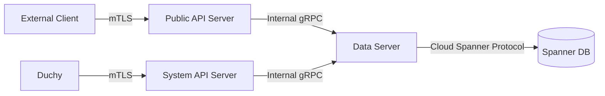

The Kingdom is deployed as three primary gRPC services that work together to provide measurement orchestration. Each service has a distinct role and security boundary.

## Service Overview

<CardGroup cols={3}>
  <Card title="Data Server" icon="database">
    Internal API for direct database access
  </Card>
  <Card title="System API" icon="network-wired">
    API for system components (Duchies)
  </Card>
  <Card title="Public API" icon="users">
    API for external clients (MCs, EDPs)
  </Card>
</CardGroup>

## GCP Kingdom Data Server

**Image**: `kingdom/data-server`  
**Service Name**: `gcp-kingdom-data-server`  
**Port**: 8443 (gRPC), 8080 (health)

### Purpose

The Kingdom Data Server is the **internal API layer** that provides direct access to the Kingdom's Spanner database. It is not exposed externally and is only accessible to other Kingdom services within the cluster.

### Responsibilities

- Execute direct database operations against Cloud Spanner
- Provide CRUD operations for all Kingdom entities
- Manage database schema migrations via init containers
- Enforce data consistency and transaction boundaries
- Internal service-to-service communication only

### Key Features

<Accordion title="Schema Management">
  The Data Server deployment includes an init container (`update-kingdom-schema`) that automatically runs schema migrations before the main server starts. This ensures the database schema is always up-to-date with the application code.
</Accordion>

<Accordion title="Spanner Configuration">
  The service is configured with Spanner connection parameters including:
  - Instance ID
  - Database name
  - Project ID
  - Connection pool settings
  - Transaction timeout configurations
</Accordion>

<Accordion title="Protocol Configurations">
  Loads protocol-specific configurations from mounted volumes:
  - Liquid Legions V2 protocol config (`llv2_protocol_config_config.textproto`)
  - Reach-Only LLv2 config (`ro_llv2_protocol_config_config.textproto`)
  - HMSS protocol config (`hmss_protocol_config_config.textproto`)
  - TrusTee protocol config (`trustee_protocol_config_config.textproto`)
</Accordion>

### Configuration Flags

```bash
--duchy-info-config=/var/run/secrets/files/duchy_cert_config.textproto
--duchy-id-config=/var/run/secrets/files/duchy_id_config.textproto
--llv2-protocol-config-config=/var/run/secrets/files/llv2_protocol_config_config.textproto
--ro-llv2-protocol-config-config=/var/run/secrets/files/ro_llv2_protocol_config_config.textproto
--hmss-protocol-config-config=/var/run/secrets/files/hmss_protocol_config_config.textproto
--trustee-protocol-config-config=/var/run/secrets/files/trustee_protocol_config_config.textproto
--tls-cert-file=/var/run/secrets/files/kingdom_tls.pem
--tls-key-file=/var/run/secrets/files/kingdom_tls.key
--cert-collection-file=/var/run/secrets/files/kingdom_root.pem
--known-event-group-metadata-type=/etc/[app]/config-files/known_event_group_metadata_type_set.pb
```

### Network Policy

The Data Server only accepts connections from:
- `v2alpha-public-api-server`
- `system-api-server`
- `resource-setup` jobs
- Kingdom CronJobs (deletion, cancellation)
- Monitoring services (`operational-metrics`, `measurement-system-prober`)

It requires egress to Google Cloud Spanner.

## System API Server

**Image**: `kingdom/system-api`  
**Service Name**: `system-api-server`  
**Port**: 8443 (gRPC), 8080 (health)  
**Type**: External Service

### Purpose

The System API Server exposes gRPC services for **system-level components** including Duchies, simulators, and internal automation. It provides APIs for computation coordination and system administration.

### Key Services

The System API includes services for:

<CardGroup cols={2}>
  <Card title="Computations" icon="calculator">
    System-level computation management and coordination
  </Card>
  <Card title="Computation Participants" icon="users-gear">
    Tracking duchy participation in measurements
  </Card>
  <Card title="Requisitions" icon="file-invoice">
    System view of data requisitions
  </Card>
  <Card title="Certificates" icon="certificate">
    Certificate lifecycle management
  </Card>
</CardGroup>

### API Endpoints

Based on the `system` API package structure, the System API provides:

- **ComputationsService**: Query and update computation states
- **ComputationParticipantsService**: Manage duchy participation
- **RequisitionsService**: Track requisition fulfillment
- **CertificatesService**: Certificate validation and management
- **DataProvidersService**: System-level EDP operations

### Authentication

Uses mutual TLS with certificate validation:
- Duchy identity verified via TLS certificates
- Authority Key Identifier (AKID) mapping to principals
- Certificate collection for trusted roots

### Configuration

```bash
--debug-verbose-grpc-client-logging=[true|false]
--debug-verbose-grpc-server-logging=[true|false]
--duchy-info-config=/var/run/secrets/files/duchy_cert_config.textproto
--tls-cert-file=/var/run/secrets/files/kingdom_tls.pem
--tls-key-file=/var/run/secrets/files/kingdom_tls.key
--cert-collection-file=/var/run/secrets/files/all_root_certs.pem
--internal-api-target=[gcp-kingdom-data-server target]
--internal-api-cert-host=localhost
```

### Dependencies

The System API Server depends on:
- **gcp-kingdom-data-server**: For database operations
- **Spanner**: Indirect dependency via Data Server

## V2Alpha Public API Server

**Image**: `kingdom/v2alpha-public-api`  
**Service Name**: `v2alpha-public-api-server`  
**Port**: 8443 (gRPC), 8080 (health)  
**Type**: External Service

### Purpose

The Public API Server exposes the **primary external API** for Measurement Consumers and Event Data Providers. It provides the v2alpha version of the public CMMS API.

### Key Services

Located in `src/main/kotlin/org/wfanet/measurement/kingdom/service/api/v2alpha/`, the Public API includes:

<CardGroup cols={2}>
  <Card title="Measurements" icon="chart-line">
    Create and manage measurement campaigns
  </Card>
  <Card title="Event Groups" icon="layer-group">
    Register and manage event data sources
  </Card>
  <Card title="Data Providers" icon="building">
    EDP registration and management
  </Card>
  <Card title="Measurement Consumers" icon="user-tie">
    MC account and resource management
  </Card>
</CardGroup>

### Complete Service List

The v2alpha Public API provides these gRPC services:

**Account Management:**
- `AccountsService`: User account lifecycle
- `ApiKeysService`: API key generation and management
- `ClientAccountsService`: Client account administration

**Measurement Resources:**
- `MeasurementsService`: Core measurement operations
- `MeasurementConsumersService`: MC resource management
- `DataProvidersService`: EDP resource management

**Event Data:**
- `EventGroupsService`: Event group CRUD operations
- `EventGroupMetadataDescriptorsService`: Metadata schema management
- `EventGroupActivitiesService`: Track event group processing

**Certificates:**
- `CertificatesService`: Certificate lifecycle and validation

**Panel Exchange:**
- `ExchangesService`: Panel exchange orchestration
- `ExchangeStepsService`: Individual exchange step management
- `ExchangeStepAttemptsService`: Track execution attempts

**Modeling:**
- `ModelProvidersService`: Model provider registration
- `ModelLinesService`: Model line management
- `ModelReleasesService`: Model release tracking
- `ModelRolloutsService`: Model deployment orchestration
- `ModelSuitesService`: Model suite configuration
- `ModelShardsService`: Model sharding for scale
- `ModelOutagesService`: Track model availability

**Population Management:**
- `PopulationsService`: Population definition and management

### Authentication & Authorization

The Public API supports multiple authentication mechanisms:

<Accordion title="API Key Authentication">
  Implemented via `ApiKeyAuthenticationServerInterceptor`, this allows clients to authenticate using API keys registered in the Kingdom.
</Accordion>

<Accordion title="Account Authentication">
  Session-based authentication via `AccountAuthenticationServerInterceptor` for user accounts.
</Accordion>

<Accordion title="Certificate-based (mTLS)">
  Mutual TLS authentication using X.509 certificates with AKID-to-principal mapping.
</Accordion>

### Configuration Flags

```bash
--debug-verbose-grpc-client-logging=[true|false]
--debug-verbose-grpc-server-logging=[true|false]
--llv2-protocol-config-config=/var/run/secrets/files/llv2_protocol_config_config.textproto
--ro-llv2-protocol-config-config=/var/run/secrets/files/ro_llv2_protocol_config_config.textproto
--hmss-protocol-config-config=/var/run/secrets/files/hmss_protocol_config_config.textproto
--trustee-protocol-config-config=/var/run/secrets/files/trustee_protocol_config_config.textproto
--enable-hmss
--enable-trustee  # Optional, when TrusTee is enabled
--tls-cert-file=/var/run/secrets/files/kingdom_tls.pem
--tls-key-file=/var/run/secrets/files/kingdom_tls.key
--cert-collection-file=/var/run/secrets/files/all_root_certs.pem
--internal-api-target=[gcp-kingdom-data-server target]
--internal-api-cert-host=localhost
--authority-key-identifier-to-principal-map-file=/etc/[app]/config-files/authority_key_identifier_to_principal_map.textproto
--open-id-redirect-uri=https://localhost:2048
--duchy-info-config=/var/run/secrets/files/duchy_cert_config.textproto
--direct-noise-mechanism=NONE
--direct-noise-mechanism=CONTINUOUS_LAPLACE
--direct-noise-mechanism=CONTINUOUS_GAUSSIAN
```

### Noise Mechanisms

The Public API supports differential privacy noise mechanisms:
- **NONE**: No noise (for testing)
- **CONTINUOUS_LAPLACE**: Laplace noise for epsilon-DP
- **CONTINUOUS_GAUSSIAN**: Gaussian noise for (epsilon, delta)-DP

### Dependencies

The Public API Server requires:
- **gcp-kingdom-data-server**: Backend database operations
- **ConfigMaps**: Authority key identifier mapping and event group metadata types

## Service Communication Flow



## Deployment Details

All Kingdom services share common deployment characteristics:

- **Container Runtime**: JVM-based (Kotlin)
- **Health Checks**: HTTP endpoint on port 8080
- **Secrets Management**: Kubernetes secrets for TLS certs and keys
- **Configuration**: ConfigMaps for protocol configs and mappings
- **Init Containers**: Schema migration before server start (Data Server only)
- **Network Policies**: Strict ingress/egress rules

### Resource Allocation

Default resource requests/limits are defined in the base Kubernetes configuration. Services can be scaled horizontally based on load.

### Monitoring

All services expose:
- gRPC health checks
- HTTP health endpoints
- Optional verbose logging for debugging
- OpenTelemetry instrumentation (when configured)

## Security Considerations

<Note>
**Defense in Depth**: The three-tier architecture (Data Server, System API, Public API) provides security isolation between internal operations, system components, and external clients.
</Note>

- **Minimal External Exposure**: Only System API and Public API are externally accessible
- **Certificate Validation**: All connections use mutual TLS
- **Network Policies**: Kubernetes NetworkPolicies restrict traffic
- **Secret Rotation**: Secrets can be rotated without code changes
- **Audit Logging**: All API operations are logged

## Next Steps

<CardGroup cols={2}>
  <Card title="Kingdom Daemons" icon="robot" href="/components/kingdom/daemons">
    Learn about background jobs and scheduled tasks
  </Card>
  <Card title="Duchy Services" icon="network-wired" href="/components/duchy/services">
    Explore services that coordinate with the Kingdom
  </Card>
</CardGroup>
